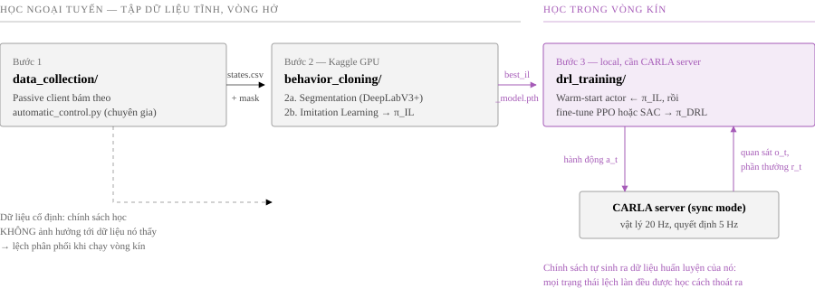
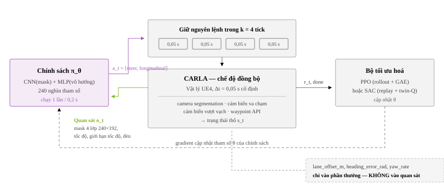
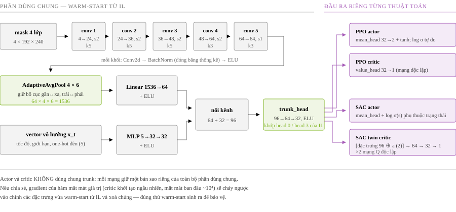
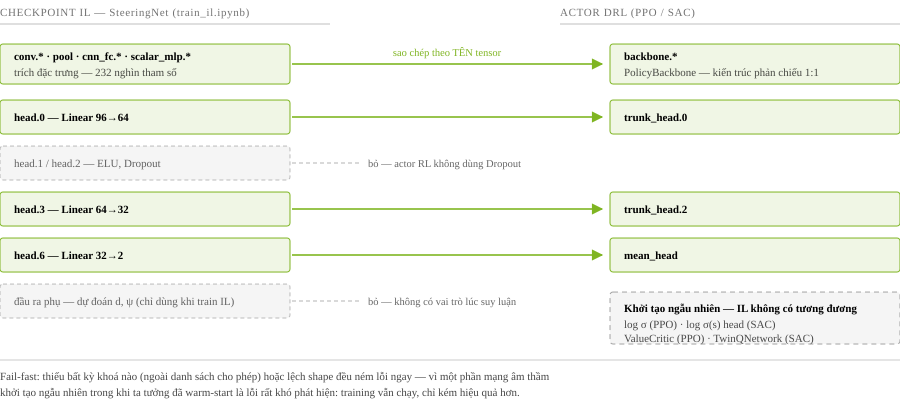
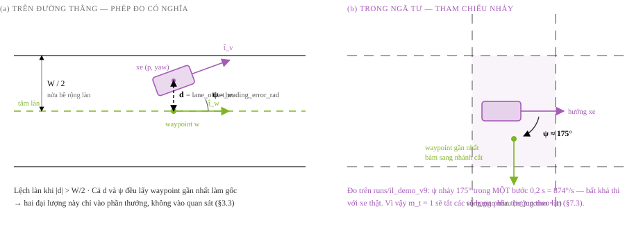
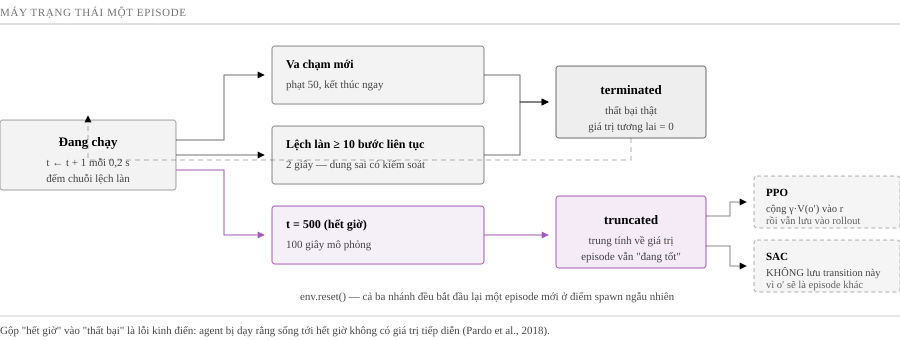
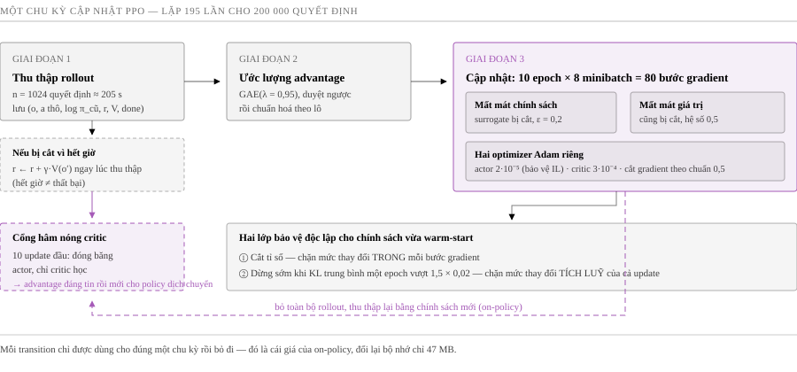
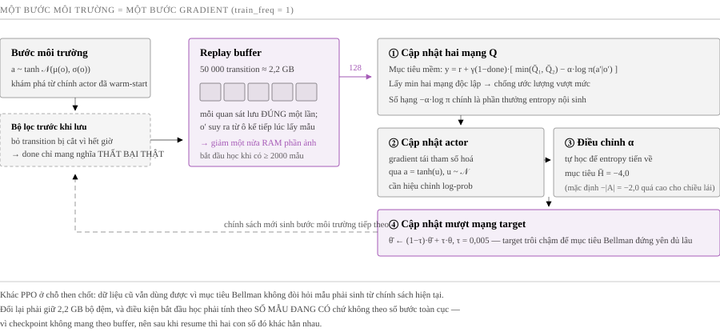

# Thiết kế Thuật toán Học tăng cường sâu cho Bài toán Điều khiển Bám làn (CARLA 0.9.10)

> Tài liệu **thiết kế thuật toán** (không phải hướng dẫn vận hành — xem
> `manual_train_drl.md` cho quy trình cài đặt/chạy). Mục tiêu: trình bày trọn vẹn **cơ sở lý
> luận** của bước 3/3 trong pipeline đồ án — từ cách hình thức hoá bài toán lái xe thành một
> quá trình quyết định Markov, thiết kế không gian quan sát/hành động/phần thưởng, kiến trúc
> mạng, chiến lược khởi tạo nóng từ Imitation Learning, cho tới hai thuật toán tối ưu hoá
> (PPO, SAC), vòng lặp huấn luyện và giao thức đánh giá — đủ để đưa trực tiếp vào chương
> "Phương pháp" / "Thiết kế hệ thống" của báo cáo đồ án tốt nghiệp.
>
> **Mã nguồn tương ứng**: `drl_training/envs/carla_lane_keep_env.py`,
> `drl_training/policy/{observation,backbone,actor_critic,il_compat,checkpoint_io}.py`,
> `drl_training/ppo/{ppo_agent,rollout_buffer}.py`,
> `drl_training/sac/{networks,sac_agent,replay_buffer}.py`,
> `drl_training/{config.py,train_ppo.py,train_sac.py,evaluate.py,plot_metrics.py}`.
> **Tài liệu liên quan**: `thiet_ke_ham_thuong_va_toi_uu.md` (bản trước, hẹp hơn — tài liệu
> này thay thế và cập nhật nó), `thiet_ke_thuat_toan_astar.md` (điều hướng toàn cục),
> `csv_fields_by_task.md` (hợp đồng dữ liệu chung cho cả 3 bước).

---

## Mục lục

1. [Bối cảnh, phạm vi và các quyết định thiết kế cốt lõi](#1-bối-cảnh-phạm-vi-và-các-quyết-định-thiết-kế-cốt-lõi)
2. [Hình thức hoá bài toán thành MDP](#2-hình-thức-hoá-bài-toán-thành-mdp)
3. [Thiết kế không gian quan sát](#3-thiết-kế-không-gian-quan-sát)
4. [Thiết kế không gian hành động](#4-thiết-kế-không-gian-hành-động)
5. [Thiết kế kiến trúc mạng nơ-ron](#5-thiết-kế-kiến-trúc-mạng-nơ-ron)
6. [Chiến lược khởi tạo nóng từ Imitation Learning](#6-chiến-lược-khởi-tạo-nóng-từ-imitation-learning)
7. [Thiết kế hàm phần thưởng](#7-thiết-kế-hàm-phần-thưởng)
8. [Thiết kế điều kiện kết thúc episode](#8-thiết-kế-điều-kiện-kết-thúc-episode)
9. [Thuật toán PPO — tối ưu hoá on-policy](#9-thuật-toán-ppo--tối-ưu-hoá-on-policy)
10. [Thuật toán SAC — tối ưu hoá off-policy](#10-thuật-toán-sac--tối-ưu-hoá-off-policy)
11. [So sánh hai thuật toán và bảng siêu tham số](#11-so-sánh-hai-thuật-toán-và-bảng-siêu-tham-số)
12. [Vòng lặp huấn luyện và ràng buộc hệ thống](#12-vòng-lặp-huấn-luyện-và-ràng-buộc-hệ-thống)
13. [Giao thức đánh giá và thước đo](#13-giao-thức-đánh-giá-và-thước-đo)
14. [Rủi ro thiết kế, hạn chế và hướng phát triển](#14-rủi-ro-thiết-kế-hạn-chế-và-hướng-phát-triển)
15. [Tài liệu tham khảo](#15-tài-liệu-tham-khảo)

---

## 1. Bối cảnh, phạm vi và các quyết định thiết kế cốt lõi

### 1.1 Vị trí của bước DRL trong pipeline

Đồ án chia bài toán "xe tự hành bám làn" thành ba bước, mỗi bước giải một bài toán con có
thể kiểm chứng độc lập:

```
1) data_collection/     Thu thập dữ liệu chuyên gia (passive client bám theo automatic_control.py)
                        → states.csv + ảnh nhãn segmentation
        ▼
2) behavior_cloning/    2a. Segmentation (DeepLabV3+)  →  best_carla_segmentation.pth
   [Kaggle, GPU]        2b. Imitation Learning (CNN+MLP → [steer, longitudinal])
                        → best_il_model.pth  (chính sách π_IL)
        ▼
3) drl_training/        Warm-start actor từ π_IL, fine-tune bằng PPO HOẶC SAC
   [Local + CARLA]      trong vòng kín với CARLA server sống  →  chính sách π_DRL
```



Tài liệu này chỉ đặc tả bước 3. Điểm mấu chốt về mặt phương pháp: **DRL ở đây không huấn
luyện từ số 0 mà là bước tinh chỉnh (fine-tune) một chính sách đã có sẵn từ học bắt chước**
— tức mẫu hình *BC-then-RL* (Behaviour Cloning rồi Reinforcement Learning), được chọn có chủ
đích vì lý do trình bày ở §6.1.

### 1.2 Vì sao cần bước DRL sau khi đã có IL

Học bắt chước (IL) huấn luyện theo kiểu học có giám sát trên dữ liệu chuyên gia, nên mắc hai
hạn chế cố hữu mà không lượng dữ liệu nào xoá được:

| Hạn chế của IL | Bản chất | DRL khắc phục thế nào |
|---|---|---|
| **Lệch phân phối (covariate shift / exposure bias)** | IL chỉ thấy các trạng thái mà chuyên gia đi qua. Khi xe trôi lệch nhẹ ra ngoài phân phối đó, IL chưa từng học cách quay về, sai số **tự khuếch đại** theo vòng kín | DRL học **trong chính vòng kín**: mọi trạng thái mà chính sách hiện tại tạo ra đều trở thành dữ liệu huấn luyện, kể cả các trạng thái lệch làn |
| **Không có khái niệm "tốt/xấu"** | IL tối thiểu hoá sai số so với hành động chuyên gia, không tối ưu bất kỳ tiêu chí lái xe nào (an toàn, êm, đúng tốc độ) | DRL tối ưu **trực tiếp** một hàm mục tiêu do ta thiết kế (§7), nên có thể yêu cầu "êm hơn chuyên gia" hoặc "an toàn hơn chuyên gia" |

Đo thực nghiệm trên chính đồ án này (`drl_training/runs/il_demo_v9_*`) cho thấy đúng cả hai:
chính sách IL chạy vòng kín có episode bám làn rất tốt (độ lệch trung bình ngoài ngã tư
0,043 m, đi 774 m không va chạm) xen kẽ với episode hỏng sớm (va chạm sau 164 bước) — dấu
hiệu điển hình của lệch phân phối chứ không phải của một mô hình học kém.

### 1.3 Phạm vi

**Trong phạm vi**: điều khiển bám làn cục bộ — giữ xe ở tâm làn, giữ hướng song song với làn,
di chuyển ở tốc độ hợp lý, không va chạm.

**Ngoài phạm vi (có chủ đích)**: điều hướng toàn cục theo tuyến A\*. Không gian quan sát
**không** chứa `route_command`/`route_target_local_*`, nên chính sách không biết nên rẽ hướng
nào ở ngã tư; đây là việc của module `router_plan/` (xem `thiet_ke_thuat_toan_astar.md`) và
được xử lý ở tầng tích hợp (chế độ "Route + DRL Autopilot" của Bridge Server: A\* quyết định
đi đường nào, chính sách DRL quyết định lái thế nào trong làn). Hệ quả trực tiếp của quyết
định phạm vi này là cơ chế **vô hiệu hoá các số hạng phần thưởng theo làn trong ngã tư**
(§7.3) — không thể chấm điểm một chính sách vì đã "chọn sai nhánh" khi bản thân nó không
được cho biết nhánh nào là đúng.

### 1.4 Các quyết định thiết kế cốt lõi

Bảy quyết định dưới đây định hình toàn bộ phần còn lại của tài liệu; mỗi quyết định được lý
giải chi tiết ở mục tương ứng:

| # | Quyết định | Mục |
|---|---|---|
| 1 | Loại khỏi quan sát mọi đại lượng là **hệ quả** của chính hành động cần dự đoán (`yaw_rate`, `previous_steer`, `previous_longitudinal`) — chống rò rỉ nhân quả | §3.2 |
| 2 | Tách bạch **đại lượng để quyết định** (observation) và **đại lượng để chấm điểm** (`lane_offset_m`, `heading_error_rad` chỉ vào reward) | §3.3 |
| 3 | Nhịp ra quyết định 5 Hz (`fps=20 × action_repeat=4`) — bằng đúng `control_dt` của checkpoint IL, trong khi vật lý vẫn chạy 20 Hz | §2.3 |
| 4 | Warm-start actor từ IL bằng **remap theo tên tensor**, thiết kế *fail-fast*; critic/Q luôn khởi tạo ngẫu nhiên | §6 |
| 5 | Đóng băng thống kê BatchNorm trong toàn bộ quá trình RL | §5.4 |
| 6 | Vô hiệu hoá các số hạng phần thưởng theo làn khi xe ở trong ngã tư | §7.3 |
| 7 | Hai thuật toán (PPO, SAC) dùng **chung** env/reward/quan sát/backbone — chỉ khác cách cập nhật, để so sánh thực nghiệm là công bằng | §11 |

---

## 2. Hình thức hoá bài toán thành MDP

### 2.1 Bộ năm `(S, A, P, r, γ)`
Bài toán được hình thức hoá thành một quá trình quyết định Markov (MDP) với không gian
trạng thái và hành động liên tục:

$$\mathcal{M} = (\mathcal{S},\, \mathcal{A},\, P,\, r,\, \gamma), \qquad \gamma = 0.99 \tag{1}$$

Mục tiêu học là tìm chính sách cực đại hoá kỳ vọng tổng phần thưởng chiết khấu:

$$\pi^{\star} = \arg\max_{\pi}\, J(\pi), \qquad
J(\pi) = \mathbb{E}_{\tau \sim \pi}\!\left[\sum_{t=0}^{T-1} \gamma^{t}\, r(s_t, a_t)\right] \tag{2}$$

với hai hàm giá trị chuẩn dùng xuyên suốt hai thuật toán ở §9 và §10:

$$V^{\pi}(s) = \mathbb{E}_{\pi}\!\left[\sum_{k\ge 0}\gamma^{k} r_{t+k} \,\middle|\, s_t = s\right],
\qquad
Q^{\pi}(s,a) = \mathbb{E}_{\pi}\!\left[\sum_{k\ge 0}\gamma^{k} r_{t+k} \,\middle|\, s_t = s,\, a_t = a\right] \tag{3}$$


| Thành phần | Định nghĩa trong đồ án | Ghi chú thiết kế |
|---|---|---|
| **Trạng thái `s ∈ S`** | Cặp `(seg, x)`: ảnh phân vùng ngữ nghĩa 4 lớp `240×192` (bản đồ class-ID) + vector vô hướng 5 chiều (§3.1) | Đây thực chất là **quan sát**, không phải trạng thái đầy đủ của thế giới — xem §2.2 |
| **Hành động `a ∈ A`** | `[steer, longitudinal] ∈ [-1, 1]²` | Liên tục, 2 chiều; trùng khớp định dạng nhãn của bước thu thập dữ liệu và IL (§4) |
| **Chuyển trạng thái `P`** | Vật lý CARLA UE4 ở chế độ đồng bộ (`synchronous_mode=True`, `fixed_delta_seconds=0.05`) | Một hành động ↔ đúng 4 tick vật lý xác định, tái lập được — điều kiện tiên quyết để reward và log nhất quán giữa các lần chạy |
| **Phần thưởng `r`** | Hàm shaping nhiều thành phần, có mặt nạ ngã tư (§7) | Dày (dense), tính lại ở mỗi quyết định |
| **Hệ số chiết khấu `γ`** | 0.99 | Ở nhịp 5 Hz, `γ=0.99` tương ứng chân trời hiệu dụng `1/(1−γ) = 100` bước = **20 giây** lái xe — đúng thang thời gian mà một quyết định lái ảnh hưởng tới hậu quả |

### 2.2 Thực chất là POMDP, và tại sao chấp nhận xấp xỉ MDP

Quan sát không chứa đủ thông tin để suy ra trạng thái đầy đủ của thế giới (vị trí tuyệt đối,
ý định của các xe khác, phần đường bị khuất). Về hình thức, đây là một **POMDP**. Đồ án cố ý
xấp xỉ nó bằng MDP một bước (không dùng bộ nhớ hồi quy LSTM/GRU, không xếp chồng nhiều khung
hình liên tiếp) vì ba lý do:

1. **Nhất quán với IL.** `SteeringNet` ở bước IL là một mạng feed-forward một khung hình.
   Thêm bộ nhớ ở bước DRL sẽ phá vỡ khả năng warm-start theo tên tensor (§6.2).
2. **Với riêng bài toán bám làn, một khung hình gần như đủ.** Vị trí tương đối so với làn —
   thông tin quyết định của bài toán — có mặt đầy đủ trong một ảnh phân vùng duy nhất.
3. **Chi phí.** Xếp chồng `k` khung hình nhân `k` lần bộ nhớ replay buffer, vốn đã là thành
   phần tốn RAM nhất của SAC (§12.3).

Cái giá phải trả được ghi nhận minh bạch: vận tốc/gia tốc **không** suy ra được từ một ảnh
tĩnh, nên `speed_mps` được đưa vào nhánh vô hướng như một đặc trưng tường minh (§3.1).

### 2.3 Nhịp ra quyết định: 5 Hz trên nền vật lý 20 Hz

Đây là một trong những quyết định thiết kế dễ sai nhất và hoàn toàn im lặng khi sai:

```
fixed_delta_seconds = 1/20 = 0.05 s        (một tick vật lý)
action_repeat       = 4                     (mỗi quyết định giữ nguyên lệnh trong 4 tick)
⇒ control_dt        = 4 × 0.05 = 0.2 s     (nhịp ra quyết định = 5 Hz)
```

Ba ràng buộc giao nhau tại đúng cấu hình này:

- **Hợp đồng với IL.** Checkpoint IL ghi `control_dt = 1/COLLECT_FPS = 0.2 s`. Dữ liệu chuyên
  gia được thu ở 5 FPS, nên mọi đặc trưng kiểu "lệnh của bước trước" và mọi thống kê chuẩn
  hoá đều mang nghĩa "một bước = 0,2 s". Nếu env DRL gọi chính sách mỗi 0,05 s, cùng một ô
  đặc trưng sẽ mang ý nghĩa khác hẳn lúc train mà **không có exception nào được ném ra**.
- **Ràng buộc vật lý của CARLA.** Không thể đơn giản đặt `fixed_delta_seconds = 0.2` để đạt
  5 Hz: CARLA khuyến cáo `fixed_delta_seconds ≤ 0.05 s`; vượt ngưỡng thì tích phân vật lý bắt
  đầu sai (xe rung, va chạm giả).
- **Chiều dài episode.** `max_episode_steps = 500` quyết định × 0,2 s = **100 giây** mô phỏng
  mỗi episode — đủ dài để bao trọn vài khúc cua và vài ngã tư, đủ ngắn để không lãng phí ngân
  sách tương tác vào một episode đã hỏng.
Hình thức hoá nhịp thời gian và chân trời hiệu dụng tương ứng của `γ`:

$$\Delta t_{\mathrm{ctrl}} = k \cdot \Delta t_{\mathrm{sim}} = 4 \times 0.05 = 0.2\ \mathrm{s},
\qquad
H_{\mathrm{eff}} = \frac{1}{1-\gamma} = 100\ \text{steps} \equiv 20\ \mathrm{s} \tag{4}$$

Nghĩa là hệ số chiết khấu 0,99 ở nhịp 5 Hz tương ứng một "tầm nhìn" khoảng 20 giây lái xe —
đúng thang thời gian mà một quyết định đánh lái còn ảnh hưởng tới hậu quả.



`CarlaLaneKeepEnv._check_control_rate()` đối chiếu `fps/action_repeat` với `control_dt` đọc từ
checkpoint và in cảnh báo khi lệch — biến một lỗi im lặng thành một lỗi nhìn thấy được.

---

## 3. Thiết kế không gian quan sát

### 3.1 Hai nhánh: ảnh phân vùng + vector vô hướng

| Nhánh | Nội dung | Kiểu/kích thước |
|---|---|---|
| **Ảnh** | Bản đồ class-ID phân vùng ngữ nghĩa 4 lớp `[Background, Road, RoadLine, Sidewalk]` | `uint8`, `192 × 240` (H×W), one-hot hoá **trên GPU** ngay trước lớp conv |
| **Vô hướng** | `[speed_mps, speed_limit_kmh]` (chuẩn hoá z-score) + one-hot `traffic_light_state ∈ {yellow, red, unknown}` | `float32`, 5 chiều |
Hình thức hoá:

$$o_t = (M_t,\, x_t), \qquad
M_t \in \{0,1,2,3\}^{192 \times 240}, \qquad
x_t \in \mathbb{R}^{5} \tag{5}$$

$$x_t = \big[\, z(v_t),\ z(v^{\lim}_t),\ \mathrm{onehot}(\ell_t) \,\big]^{\top},
\qquad \ell_t \in \{\mathrm{yellow},\, \mathrm{red},\, \mathrm{unknown}\} \tag{6}$$

trong đó phép chuẩn hoá z-score dùng **đúng** cặp thống kê đã lưu trong checkpoint IL:

$$z(u) = \frac{u - \mu_{\mathrm{IL}}}{\sigma_{\mathrm{IL}}} \tag{7}$$


Nhánh ảnh dùng **phân vùng ngữ nghĩa** thay vì ảnh RGB thô: đây là quyết định kiến trúc từ
bước 2a của pipeline, giúp chính sách bất biến với ánh sáng/thời tiết/kết cấu vật liệu và
giảm mạnh số chiều đầu vào hiệu dụng — cái giá là chất lượng lái bị chặn trên bởi chất lượng
mô hình phân vùng.

Bảng nhãn 4 lớp là giao ước chung của cả ba bước: `data_collection/carla_collector/schema.py`
là nguồn chân lý duy nhất, được `policy/observation.py` và `policy/backbone.py` **import** chứ
không gõ lại. `ObservationContract` còn kiểm tra `num_classes` của checkpoint khớp với
`NUM_SEG_CLASSES` hiện tại và **ném lỗi** nếu lệch — vì một checkpoint IL 6 lớp cũ vẫn nạp
được về mặt shape nhưng sẽ đọc sai kênh và lái sai trong im lặng.

### 3.2 Nguyên tắc 1 — loại bỏ rò rỉ nhân quả khỏi quan sát

Đây là phát hiện thực nghiệm quan trọng nhất của phần quan sát, và là lý do tồn tại của hằng
số `LEAKY_OBSERVATION_COLS` trong `policy/observation.py`:

```python
LEAKY_OBSERVATION_COLS = ("yaw_rate_rps", "previous_steer", "previous_longitudinal")
```

Ba đại lượng này đều là **hệ quả của chính hành động đang cần dự đoán**, đo tại cùng thời
điểm. Đưa chúng vào đầu vào không phải là thêm đặc trưng mà là **rò rỉ nhãn** (label leakage):

| Cột bị loại | Cơ chế rò rỉ | Bằng chứng đo được |
|---|---|---|
| `yaw_rate_rps` | Xe đang quay **chính vì** vô-lăng đang quay — `yaw_rate` gần như là `steer` được đo lại qua vật lý | Độ nhạy `d(steer)/d(yaw_rate)` = +0,32 (checkpoint v8) và +0,44 (v4); biên độ steer do `yaw_rate` gây ra lớn **gấp 114 lần** (v8) và **290 lần** (v4) so với biên độ do **ảnh** gây ra — mô hình chỉ đọc lại đáp án |
| `previous_steer` | Cùng cơ chế, yếu hơn (chuỗi lệnh lái có tự tương quan rất cao) | Biên độ ảnh hưởng 0,175 |
| `previous_longitudinal` | Gây sụp đổ về phanh: xe đang dừng → mô hình tiếp tục ra lệnh phanh → xe tiếp tục dừng | Quan sát định tính trong demo vòng kín |

**Vì sao đây là lỗi chết người trong vòng kín chứ không phải trong đánh giá offline.** Trên
tập kiểm thử offline, các cột này luôn được cấp từ dữ liệu thật của chuyên gia, nên MAE rất
đẹp. Trong vòng kín, chúng được cấp từ **chính đầu ra của mô hình ở bước trước**, tạo thành
một vòng lặp tự duy trì: khởi tạo `yaw_rate = 0` → mô hình xuất `steer ≈ 0` → xe đi thẳng →
`yaw_rate` vẫn bằng 0 → ... Xe lao thẳng cho tới khi ra khỏi đường, bất kể ảnh cho thấy gì.
Phát biểu hình thức của hiện tượng này: gọi `φ_t` là một đặc trưng thoả `φ_t = g(a_{t-1})`
(hệ quả tất định của hành động trước), khi đó chính sách vòng kín có **điểm bất động**

$$a^{\star} = \pi_{\theta}\big(M,\, g(a^{\star})\big) \tag{8}$$

mà nghiệm `a*` **không phụ thuộc ảnh `M`**. Mọi trạng thái khởi đầu đứng yên (`a = 0`) đều rơi
vào điểm bất động này, và mô hình sẽ giữ nguyên nó vô hạn bất kể quan sát thị giác thay đổi
ra sao. Đây là lý do một mô hình có MAE ngoại tuyến rất đẹp vẫn có thể hoàn toàn không lái
được trong vòng kín.

`speed_mps` và `speed_limit_kmh` **không** thuộc nhóm này: tốc độ là hệ quả của ga **trong quá
khứ** (không phải của hành động hiện tại) và là thông tin bắt buộc để quyết định ga hiện tại.

Cơ chế bảo vệ: `ObservationContract.__init__` quét danh sách cột đọc từ checkpoint và **in
cảnh báo lớn** nếu phát hiện bất kỳ cột rò rỉ nào — để một checkpoint IL cũ không âm thầm kéo
lỗi này sang bước DRL.

### 3.3 Nguyên tắc 2 — tách đại lượng để quyết định khỏi đại lượng để chấm điểm

`lane_offset_m` và `heading_error_rad` — hai đại lượng trung tâm của hàm phần thưởng — **không
nằm trong quan sát**. Lý do gồm hai lớp:

1. **Tránh chính sách suy biến.** Nếu đưa vào, mạng nhận sẵn gần như "đáp án" của hàm mục
   tiêu và có thể học một ánh xạ gần-identity (`steer ≈ −k·lane_offset`) mà hoàn toàn bỏ qua
   ảnh — hiện tượng cùng bản chất với rò rỉ nhãn ở §3.2.
2. **Tính khả thi khi triển khai thật.** Hai đại lượng này được suy ra từ waypoint API của
   CARLA, tức từ **bản đồ HD có sẵn cộng định vị lane-level chính xác**. Một hệ thống thật
   không có sẵn chúng ở độ chính xác đó. Chính sách chỉ được nhìn thứ mà camera thật cũng
   nhìn thấy.

Ở bước IL, hai đại lượng này vẫn được dùng nhưng ở đúng vai trò hợp lệ: **mục tiêu phụ**
(`AUX_TARGET_COLS`, trọng số 0,5) — mạng bị *yêu cầu dự đoán* độ lệch làn từ ảnh, thay vì
được *cho biết* độ lệch làn. Đầu ra phụ này không được chuyển sang mạng DRL (§6.3).

### 3.4 Hợp đồng quan sát tự mô tả

`ObservationContract` đọc `continuous_cols`, `raw_action_cols`, `norm_stats`,
`traffic_light_vocab`, `scalar_feature_dim`, `control_dt` **trực tiếp từ checkpoint IL** thay
vì hard-code lại lần thứ hai. Lý do kiến trúc: notebook IL chạy trên Kaggle còn module DRL
chạy local với CARLA server — hai môi trường Python khác nhau, không thể `import` chung code.
Mã hoá hợp đồng **vào chính dữ liệu của checkpoint** là cách duy nhất khiến hai bên không thể
lệch nhau trong im lặng khi tập đặc trưng thay đổi.

Chuẩn hoá: mỗi cột liên tục được z-score bằng đúng cặp `(mean, std)` **tính trên tập train của
IL** (không tính lại trên dữ liệu DRL). Dùng thống kê khác nghĩa là đưa cho actor đã warm-start
một phân phối đầu vào lệch với phân phối nó đã học — làm hỏng warm-start mà không báo lỗi.

### 3.5 Hạ mẫu bảo tồn lớp mỏng

Có **ba** độ phân giải khác nhau trong hệ thống, và chúng không được lẫn lộn:

| Con số | Vai trò |
|---|---|
| `480 × 384` | Độ phân giải camera segmentation **render ra** (khớp `collector_config.json`) |
| `240 × 192` | Độ phân giải **quan sát** đưa vào mạng — bằng đúng `IMAGE_WIDTH/IMAGE_HEIGHT` mà IL đã train |
| `160 × 128` | Giá trị dự phòng trong code khi cấu hình thiếu trường — không dùng trong cấu hình chuẩn |

**Vì sao không render thẳng ở 240×192.** CARLA render trực tiếp ở độ phân giải cấu hình chứ
không hạ mẫu từ ảnh lớn. Render thẳng ở 240×192 thì vạch kẻ làn (rộng 1–3 px) biến mất ngay
tại bước rasterize — mất là mất vĩnh viễn.

**Vì sao không dùng nội suy thông thường khi hạ mẫu.** Trên bản đồ class-ID, nội suy
tuyến tính/bicubic sinh ra các class trung gian vô nghĩa. Nhưng `INTER_NEAREST` thuần cũng
sai: phép lấy mẫu điểm chỉ giữ lại pixel nào rơi trúng điểm lấy mẫu, nên **xoá** các lớp mỏng
hơn bước lấy mẫu — mà `RoadLine` đúng là lớp như vậy (rộng 2–3 px gần xe, 1 px gần đường chân
trời). Đo trên mask phối cảnh: hạ 384×480 → 192×240 bằng nearest thuần chỉ giữ được **69%**
số pixel `RoadLine` so với cách bảo tồn độ phủ (và 71% ở nửa xa của mặt đường — chính là vùng
quyết định xe bắt đầu vào cua sớm hay muộn).

**Giải pháp** (`resize_class_map()`): nearest toàn cục, sau đó **khôi phục lớp mỏng theo độ
phủ diện tích** — ô đầu ra nào có tỉ lệ diện tích bị `RoadLine` phủ vượt `THIN_COVER_THRESH
= 0.25` thì được gán lại thành `RoadLine`.

$$M'(i,j) =
\begin{cases}
c_{\mathrm{thin}}, & \mathrm{cov}_{c_{\mathrm{thin}}}(i,j) > \tau \\[2pt]
M_{\mathrm{NN}}(i,j), & \text{otherwise}
\end{cases}
\qquad \tau = 0.25 \tag{9}$$

trong đó `cov_c(i,j)` là **tỉ lệ diện tích** của ô đầu ra `(i,j)` bị lớp `c` phủ ở ảnh gốc, còn
`M_NN` là kết quả lấy mẫu điểm gần nhất.


Hàm này dùng **cùng bảng LUT, cùng ngưỡng, cùng thứ
tự** với `downscale_labels()` của notebook IL (cả ba hằng số nằm chung trong `schema.py`), nếu
không thì chính sách warm-start sẽ nhìn thấy vạch kẻ mỏng hơn một cách hệ thống so với lúc học.

---

## 4. Thiết kế không gian hành động

### 4.1 Hai chiều liên tục và cách ánh xạ sang lệnh điều khiển

```
a = [steer, longitudinal] ∈ [-1, 1]²

steer         → VehicleControl.steer  (âm = trái, dương = phải)
longitudinal  ≥ 0  → throttle = longitudinal,  brake = 0
              < 0  → throttle = 0,             brake = −longitudinal
```

$$a_t = [\, \delta_t,\ \lambda_t \,]^{\top} \in [-1, 1]^{2} \tag{10}$$

$$\mathrm{steer}_t = \delta_t, \qquad
\mathrm{throttle}_t = \max(\lambda_t,\, 0), \qquad
\mathrm{brake}_t = \max(-\lambda_t,\, 0) \tag{11}$$

**Vì sao gộp ga và phanh thành một chiều thay vì hai chiều riêng.** Ga và phanh loại trừ nhau
về mặt vật lý — đạp cả hai cùng lúc là hành vi vô nghĩa mà một không gian hành động hai chiều
riêng biệt lại cho phép biểu diễn (và một chính sách RL chắc chắn sẽ khám phá ra vùng đó).
Gộp thành một trục có dấu khiến trạng thái vô nghĩa **không tồn tại** trong không gian hành
động. Cách mã hoá này giống hệt `data_collection/carla_collector/writer.py`, nên nhãn của
chuyên gia, đầu ra IL và đầu ra DRL đều nằm trên cùng một thang.

### 4.2 Hai cách xử lý biên hành động khác nhau ở hai thuật toán

| | PPO (`policy/actor_critic.py`) | SAC (`sac/networks.py`) |
|---|---|---|
| Phân phối | `N(μ(s), σ)` với `μ = tanh(mean_head(·))`, `σ` **không phụ thuộc trạng thái** | `tanh(N(μ(s), σ(s)))` — squashed Gaussian, `σ` **phụ thuộc trạng thái** |
| Ép về `[-1,1]` | Lấy mẫu rồi **clip** | `tanh` bên trong phân phối |
| log-prob | Tính trên mẫu Gaussian **chưa clip** | Hiệu chỉnh đổi biến: `log π = log N(u) − Σ log(1 − tanh²(u) + ε)` |

Cả hai đều là lựa chọn **chuẩn của từng thuật toán**, không phải một bên đúng một bên sai:
$$\text{PPO:}\quad u \sim \mathcal{N}\big(\mu_{\theta}(o),\, \sigma\big),\ \ a = \mathrm{clip}(u, -1, 1)
\qquad\qquad
\text{SAC:}\quad a = \tanh(u),\ \ u \sim \mathcal{N}\big(\mu_{\theta}(o),\, \sigma_{\theta}(o)\big) \tag{12}$$


- PPO lưu `raw_action` (chưa clip) vào buffer nhưng gửi `clip(raw_action, −1, 1)` cho môi
  trường. Tính lại `log_prob` trên hành động đã clip ở thời điểm cập nhật sẽ làm **lệch mọi
  ước lượng advantage gần biên hành động**. Đây là xấp xỉ được chấp nhận rộng rãi (ví dụ
  Stable-Baselines3, CleanRL).
- SAC bắt buộc phải squash bằng `tanh` vì mục tiêu maximum-entropy cần một mật độ xác suất
  hợp lệ trên miền bị chặn; số hạng hiệu chỉnh `−log(1 − tanh²(u))` chính là định thức Jacobi
  của phép đổi biến (Haarnoja et al. 2018, phụ lục C).

---

## 5. Thiết kế kiến trúc mạng nơ-ron

### 5.1 Backbone dùng chung (`policy/backbone.py::PolicyBackbone`)

```
seg (N,192,240) uint8  ──one-hot trên GPU──►  (N,4,192,240)
   │
   ├─ Conv(4→24,  k5,s2) + BatchNorm + ELU
   ├─ Conv(24→36, k5,s2) + BatchNorm + ELU
   ├─ Conv(36→48, k5,s2) + BatchNorm + ELU
   ├─ Conv(48→64, k3,s2) + BatchNorm + ELU
   ├─ Conv(64→64, k3,s1) + BatchNorm + ELU
   ├─ AdaptiveAvgPool2d(POOL_GRID = (4,6))     →  (N,64,4,6) = 1536 chiều
   └─ Linear(1536→64) + ELU                     →  64 chiều

scalar (N,5) ─ Linear(5→32)+ELU ─ Linear(32→32)+ELU  →  32 chiều

concat → 96 chiều → trunk_head: Linear(96→64)+ELU → Linear(64→32)+ELU → 32 chiều
                       │
                       ├─ PPO actor : mean_head Linear(32→2) + tanh; log_std (tham số tự do 2 chiều)
                       ├─ PPO critic: value_head Linear(32→1)
                       ├─ SAC actor : mean_head Linear(32→2); log_std_head Linear(32→2)
                       └─ SAC critic: [feats(96) ⊕ action(2)] → 64 → 32 → 1   (×2 mạng Q)
```

Quy mô: actor ≈ **240 nghìn tham số** (backbone 232k + trunk_head 8,3k + đầu ra), critic PPO
tương đương, twin-Q của SAC ≈ 481 nghìn. Mạng cố tình rất nhỏ — điểm nghẽn thông lượng huấn
luyện là bước tick của CARLA chứ không phải phép nhân ma trận (§12.3).
Biểu diễn đặc trưng dùng chung của mọi mạng trong gói:

$$f_{\theta}(o) = \Big[\, \mathrm{CNN}_{\theta}(M) \in \mathbb{R}^{64} \ ;\ \mathrm{MLP}_{\theta}(x) \in \mathbb{R}^{32} \,\Big] \in \mathbb{R}^{96} \tag{13}$$

trong đó phép gộp không gian giữ lại lưới thô 4 × 6 thay vì trung bình toàn ảnh:

$$\mathrm{pool}: \mathbb{R}^{64 \times h \times w} \longrightarrow \mathbb{R}^{64 \times 4 \times 6} \cong \mathbb{R}^{1536} \tag{14}$$



### 5.2 `POOL_GRID = (4, 6)` thay vì `(1, 1)`

`AdaptiveAvgPool2d((1,1))` — bản thiết kế ban đầu — lấy **trung bình toàn ảnh của từng kênh**,
bóp bản đồ đặc trưng thành một con số mỗi kênh. Hệ quả: **phân bố trái–phải của làn đường —
thứ duy nhất cho xe biết nó đang lệch về bên nào — bị xoá khỏi biểu diễn**, chỉ có thể được
khôi phục gián tiếp qua tương quan giữa các kênh.

`(4, 6)` giữ lại bố cục thô: 4 hàng (gần → xa) × 6 cột (trái → phải), tức `cnn_fc` nhận 1536
chiều thay vì 64. Đây là thay đổi kiến trúc quan trọng nhất giữa phiên bản v4 và v9 của
pipeline. Hằng số này **phải khớp** giữa `train_il_v9.ipynb` và `policy/backbone.py`; lệch
một bên sẽ khiến `il_compat.load_matching` báo lỗi shape ngay tại `cnn_fc.0.weight` — cố ý để
như vậy, vì đây chính xác là loại lệch phải chết to chứ không được chạy im lặng.

`AdaptiveAvgPool2d` (thay vì `Flatten` trực tiếp) khiến backbone **bất biến với độ phân giải
đầu vào**: mọi kích thước ảnh đều chạy được. Đó vừa là ưu điểm (đổi độ phân giải không cần
sửa mạng) vừa là **cái bẫy** — sai độ phân giải không gây lỗi nào, chỉ làm warm-start mất giá
trị trong im lặng. Vì vậy độ phân giải quan sát bị khoá cứng bằng cấu hình ở 240×192 (§3.5).

### 5.3 Actor và critic **không** dùng chung trunk

Nhiều cài đặt PPO chia sẻ một trunk giữa actor và critic để tiết kiệm tính toán. Ở đây,
actor và critic dùng **hai bản sao độc lập hoàn toàn** của backbone + trunk_head. Lý do:
gradient từ value loss, nếu chảy ngược qua trunk dùng chung, sẽ làm trôi chính các đặc trưng
vừa được warm-start cẩn thận từ IL — đúng thứ mà warm-start đang cố bảo vệ. Đặc biệt nguy
hiểm ở đây vì critic khởi tạo **ngẫu nhiên**, nên value loss ở giai đoạn đầu rất lớn (đo được
`value_loss ≈ 8 000–13 000` trong 6 update đầu của `runs/ppo_demo_v9`). Chi phí tính toán tăng
thêm là không đáng kể so với một bước tick CARLA.

### 5.4 Không dùng Dropout, và đóng băng thống kê BatchNorm

**Không Dropout.** PPO tính lại `log_prob` của **cùng một hành động đã lưu** ở hai thời điểm
(lúc rollout và lúc update) để lập tỉ số importance sampling
`ratio = exp(log π_new − log π_old)`. Nếu Dropout khiến hai lần forward là hai mạng khác nhau
về mặt ngẫu nhiên, tỉ số này sẽ bị nhiễu Dropout làm lệch thay vì chỉ phản ánh bước cập nhật
chính sách. IL có Dropout trong `head`; hai lớp đó đơn giản không được ánh xạ sang.

**Đóng băng BatchNorm** (`freeze_batchnorm()`, gọi cho cả PPO và SAC ngay sau `.to(device)` và
trước rollout đầu tiên). Hai lý do độc lập, cả hai đều là lỗi im lặng:

1. **Nhất quán giữa rollout và update.** `act()` chạy actor trên **một** quan sát (batch = 1),
   `update()` chạy lại chính actor đó trên minibatch 128. Ở chế độ train, BatchNorm chuẩn hoá
   theo thống kê **của batch**, nên hai lần forward đó là hai mạng khác nhau — vi phạm đúng
   giả định nền tảng của tỉ số importance sampling. Đây là cùng một vấn đề với Dropout, còn
   nặng hơn. Với SAC, hệ quả tương đương: target critic được cập nhật bằng Polyak nên thống kê
   trôi theo batch size sẽ làm target và online critic lệch nhau không thể truy vết.
2. **Giữ trọng số warm-start.** `running_mean`/`running_var` của actor đến từ checkpoint IL và
   là một phần của hành vi đã học. Ở chế độ train, mỗi tick rollout lại cập nhật chúng bằng
   thống kê của **đúng một khung hình** (momentum 0,1), nên chỉ vài trăm bước là bộ thống kê
   IL bị ghi đè bằng nhiễu — warm-start bị xoá dần mà không có dấu hiệu gì.

Trọng số affine (`weight`/`bias`) của BatchNorm **vẫn được học bình thường**; chỉ phần thống
kê chạy bị đóng băng.

---

## 6. Chiến lược khởi tạo nóng từ Imitation Learning

### 6.1 Động cơ

Mẫu hình BC-then-RL được chọn vì hai lý do định lượng được:

1. **Ngân sách tương tác môi trường.** Một chính sách RL khởi tạo ngẫu nhiên sẽ lái ngẫu
   nhiên trong hàng nghìn bước đầu. Trong CARLA, mỗi bước đòi hỏi một tick vật lý + render —
   thông lượng đo được chỉ **≈ 14,6 quyết định/giây** (`runs/ppo_demo_v9/update_log.csv`), tức
   200 000 bước ≈ **3,8 giờ** thời gian thực. Tiêu phần lớn ngân sách đó để học lại thứ mà IL
   đã học từ dữ liệu chuyên gia là lãng phí không thể chấp nhận trong khuôn khổ một đồ án.
2. **Hiệu quả mẫu.** Fine-tune từ một chính sách đã lái hợp lý cho phép PPO/SAC tập trung
   ngân sách vào việc *cải thiện* hành vi (sửa lỗi hệ thống của IL, thích nghi với động lực
   học vòng kín mà BC không nắm được do exposure bias) thay vì học lại từ số 0.

### 6.2 Cơ chế: remap theo tên tensor, thiết kế fail-fast

`policy/il_compat.py` ánh xạ state_dict của `SteeringNet` (IL) sang các module DRL **theo tên
khoá**, dùng chung một bộ hàm cho cả PPO và SAC:

| Khoá IL | Đích trong mạng DRL | Ghi chú |
|---|---|---|
| `conv.*`, `pool.*`, `cnn_fc.*`, `scalar_mlp.*` | `backbone.*` | Toàn bộ phần trích đặc trưng |
| `head.0` (Linear 96→64) | `trunk_head.0` | `head.1/2` của IL là ELU + Dropout — Dropout bị bỏ |
| `head.3` (Linear 64→32) | `trunk_head.2` | Chỉ số lệch vì `trunk_head` không có Dropout |
| `head.6` (Linear 32→2) | `mean_head` | Lớp hành động cuối |

Điều kiện bắt buộc để cơ chế này hoạt động: `PolicyBackbone` và `build_trunk_head` phải
**phản chiếu `SteeringNet` đến từng tên thuộc tính**. Đây không phải lựa chọn phong cách mà
là ràng buộc chức năng; docstring ở cả hai phía đều ghi rõ "sửa một bên thì phải sửa bên kia".
Gọi `Φ` là phép ánh xạ tên khoá ở bảng trên, quá trình khởi tạo được viết gọn thành:

$$\theta^{(0)}\big|_{\mathcal{K}} = \Phi\big(\theta_{\mathrm{IL}}\big),
\qquad
\mathcal{K} = \{\mathrm{backbone},\ \mathrm{trunk\_head},\ \mathrm{mean\_head}\} \tag{15}$$

$$\theta^{(0)}\big|_{\mathcal{K}^{c}} \sim \mathrm{init}(\cdot),
\qquad
\mathcal{K}^{c} = \{\log\sigma,\ V_{\phi},\ Q_{\phi_1},\ Q_{\phi_2}\} \tag{16}$$



**Thiết kế fail-fast.** `load_matching()` ném `RuntimeError` khi: (a) một khoá của module
không tìm thấy trọng số IL tương ứng (trừ danh sách `allow_missing` tường minh), hoặc (b)
shape lệch. Không có nhánh nào "âm thầm bỏ qua". Lý do: bỏ qua âm thầm nghĩa là một phần mạng
khởi tạo ngẫu nhiên trong khi ta tưởng đã warm-start — training vẫn "chạy được", chỉ kém hiệu
quả hơn, và rất dễ bị quy nhầm cho siêu tham số. Thông báo lỗi còn được viết theo tình huống:
lệch ở `cnn_fc` gần như luôn do `POOL_GRID` lệch, nên thông báo nói thẳng điều đó kèm cách
khắc phục. Cùng tinh thần đó, `checkpoint_io.load_il_checkpoint()` kiểm tra checkpoint có đủ 7
trường bắt buộc trước khi bất cứ thứ gì được khởi tạo.

### 6.3 Những gì **không** được warm-start

| Thành phần | Vì sao không |
|---|---|
| PPO `log_std`, SAC `log_std_head` | IL không có khái niệm "biên độ nhiễu khám phá" — nó chỉ học ánh xạ trạng thái→hành động tất định |
| PPO `ValueCritic`, SAC `TwinQNetwork` | IL chưa từng học một hàm giá trị; không có trọng số nào để chuyển. Nhất quán với thực hành BC+RL chuẩn (ví dụ AWAC) |
| Đầu ra phụ của IL (dự đoán `lane_offset_m`/`heading_error_rad`) | Chỉ là công cụ định hướng biểu diễn lúc train IL (§3.3), không có vai trò lúc suy luận. Các hàm remap không chọn tiền tố này nên nó bị bỏ qua |

### 6.4 Ba lớp bảo vệ chính sách vừa warm-start

Vấn đề trung tâm của BC-then-RL: **một critic khởi tạo ngẫu nhiên sinh ra advantage gần như
nhiễu trắng trong những update đầu**, và gradient chính sách theo nhiễu đó sẽ xoá sạch trọng
số IL trước khi critic kịp học được gì. Ba biện pháp độc lập chống lại điều này:

**(a) Khởi tạo `log_std` nhỏ, và khác nhau theo từng chiều hành động.**

```
log_std_init = [-3.0, -1.5]   ⇒   σ_steer = e^(-3.0) ≈ 0.050,  σ_long = e^(-1.5) ≈ 0.223
```

Hai chiều này **không cùng thang đo chút nào**: trên tập validation, `|steer|` điển hình chỉ
nằm trong khoảng 0,005–0,03, trong khi `longitudinal` chạy cả dải `[-1, 1]`. Một giá trị dùng
chung như `log_std = -1.2` (σ ≈ 0,3) sẽ là nhiễu **gấp 10–60 lần tín hiệu** ở chiều lái — đủ
để lăng xe ra khỏi làn ngay trong rollout đầu tiên, phá hỏng đúng thứ mà warm-start sinh ra để
bảo vệ. Với `σ_steer = 0,05`, biên độ khám phá cùng bậc độ lớn với chính lệnh lái.

**(b) Tách learning rate của actor và critic.**

```
actor_lr  = 2e-5      (nhỏ — bảo vệ trọng số IL)
critic_lr = 3e-4      (bình thường — critic cần học nhanh vì bắt đầu từ số 0)
```

Dùng một learning rate chung cho cả hai buộc phải chọn giữa "critic học quá chậm" và "actor
bị xoá quá nhanh". Tách ra thì không phải chọn.

**(c) Giai đoạn hâm nóng critic (`critic_warmup_updates = 10`).** Trong 10 update đầu, actor
bị **đóng băng hoàn toàn** (`freeze_actor=True`): chỉ có value loss được lan truyền ngược, và
không gradient nào chạm vào actor. Critic học xong hàm giá trị **quanh chính hành vi của IL**
trước, rồi mới cho phép chính sách dịch chuyển. Actor vẫn chạy forward để ghi log
`approx_kl`/`entropy` cho tiện theo dõi.

> **Dấu vân tay trong log.** Ở `runs/ppo_demo_v9`, cả 6 update đều nằm trong giai đoạn hâm
> nóng critic, và log phản ánh đúng như vậy: `policy_loss ≈ 10⁻⁸`, `approx_kl ≈ 10⁻⁸`,
> `clip_fraction = 0`, `entropy` đứng yên tuyệt đối ở −1,662, trong khi `value_loss` biến
> động mạnh (8 291 → 13 221 → 5 904) và `mean_episode_reward` tăng từ 1 305 lên 2 884. Đây là
> chữ ký kỳ vọng của "actor đóng băng, critic đang học" — không phải dấu hiệu training hỏng,
> và cũng **không** phải bằng chứng PPO đang cải thiện chính sách (§13.4).

---

## 7. Thiết kế hàm phần thưởng

### 7.1 Ba nguyên tắc chi phối

1. **Phần thưởng dày (dense/shaped), không thưa.** Một episode dài tới 500 quyết định. Nếu
   chỉ thưởng khi hoàn thành và phạt khi va chạm, tín hiệu học quá thưa để gán công
   (credit assignment) cho hành động cụ thể nào đã dẫn tới hậu quả hàng trăm bước sau. Do đó
   phần thưởng được shape thành tổng nhiều thành phần liên tục, tính lại ở **mỗi quyết định**.
2. **Tách quan sát khỏi thước đo** (§3.3).
3. **Tái sử dụng đúng các trường đã chuẩn hoá xuyên suốt pipeline.** Mọi tên trường và đơn vị
   (m, m/s, rad, rad/s) khớp `csv_fields_by_task.md`; `lane_offset_m`/`heading_error_rad` được
   tính bởi **đúng một hàm** (`policy/observation.py::build_vehicle_state`) dùng chung cho env
   DRL, script đánh giá và Bridge Server — để ba nơi không hiểu cùng một khái niệm theo ba
   cách khác nhau.

### 7.2 Công thức đầy đủ

Cài đặt tại `CarlaLaneKeepEnv._compute_reward()`:
Trước hết, hai đại lượng hình học nền tảng — độ lệch ngang có dấu và sai số hướng — được định
nghĩa qua waypoint `w_t` gần nhất trên làn, với `n̂` là pháp tuyến đơn vị của hướng làn:

$$d_t = (p_t - w_t)^{\top}\, \hat{n}_{w_t},
\qquad
\psi_t = \mathrm{wrap}_{[-\pi,\pi)}\big(\theta^{v}_t - \theta^{w}_t\big) \tag{17}$$

$$\mathbf{1}^{\mathrm{off}}_t = \mathbf{1}\big[\, |d_t| > W_t / 2 \,\big] \tag{18}$$

Hàm phần thưởng đầy đủ (cài đặt tại `CarlaLaneKeepEnv._compute_reward()`):

$$
\begin{aligned}
r_t = \;& w_{v}\, \mathrm{clip}\big(v^{\parallel}_t,\, 0,\, v^{\lim}_t\big) \\
&- (1 - m_t)\Big(w_{d}\,|d_t| \;+\; w_{\psi}\,|\psi_t| \;+\; \beta_{\mathrm{off}}\, \mathbf{1}^{\mathrm{off}}_t\Big) \\
&- w_{\delta}\,(\Delta \delta_t)^{2} \;-\; w_{\lambda}\,(\Delta \lambda_t)^{2} \;-\; w_{\omega}\, \omega_t^{2} \\
&- \beta_{\mathrm{inv}}\, n^{\mathrm{inv}}_t \;-\; \beta_{\mathrm{col}}\, \mathbf{1}^{\mathrm{col}}_t
\end{aligned}
\tag{19}$$

với `Δδ_t = δ_t − δ_{t−1}`, `Δλ_t = λ_t − λ_{t−1}` (so với hành động **đã áp dụng** ở bước
trước), `ω_t` là tốc độ xoay thân xe, `n^inv_t` là số lần vượt vạch mới trong bước, và

$$m_t = \mathbf{1}\big[\,\mathrm{is\_junction}(w_t)\,\big],
\qquad
v^{\lim}_t = \max\big(\mathrm{speed\_limit}_t / 3.6,\ 10^{-6}\big) \tag{20}$$

Dạng viết theo mã nguồn (giữ nguyên tên tham số cấu hình để đối chiếu):

```
m_t = 1[ is_junction_t ]            (mặt nạ ngã tư — xem §7.3)

r_t =   w_speed        · clip(v_forward,t , 0, v_limit)
      − (1 − m_t) · w_lane_offset · |lane_offset_m,t|
      − (1 − m_t) · w_heading     · |heading_error_rad,t|
      − w_steer_delta  · (steer_t − steer_{t−1})²
      − w_long_delta   · (long_t  − long_{t−1})²
      − w_yaw_rate     · yaw_rate_t²
      − (1 − m_t) · 1[off_lane_t] · off_lane_penalty
      − n_lane_invasion,t · lane_invasion_penalty
      − 1[collision_t]  · collision_penalty
```

với `v_limit = max(speed_limit_kmh / 3.6, 10⁻⁶)` (m/s; chặn dưới để tránh chia 0 khi API CARLA
trả về `speed_limit_kmh = 0`), và `steer_{t−1}`/`long_{t−1}` là hành động **đã thực sự áp
dụng** ở bước trước (không phải mẫu thô chưa clip).

### 7.3 Mặt nạ ngã tư — thành phần thiết kế đặc thù của đồ án

`lane_offset_m`, `heading_error_rad` và cờ `off_lane` đều suy ra từ "làn đường gần nhất"
(`world_map.get_waypoint(location, project_to_road=True)`). **Trong ngã tư, phép đo này hỏng**:
các nhánh cắt nhau nên "làn gần nhất" nhảy sang nhánh vuông góc hoặc ngược chiều chỉ sau vài
mét. Bằng chứng đo được trên `runs/il_demo_v9`: `heading_error` nhảy **175 độ trong một bước
0,2 s**, tương đương tốc độ xoay 874 độ/giây — bất khả thi với một chiếc xe thật. Đó là **tham
chiếu nhảy**, không phải xe quay.



Hệ quả nếu không xử lý: chính sách bị trừ điểm dữ dội vì một độ lệch vô nghĩa (đo được −2,4
đến −4,0 điểm/bước) **đúng ở những bước khó nhất**, và cả ba episode trong lần đo đều kết thúc
trong khoảng 13 bước sau khi tham chiếu nhảy. Đó là đưa vào bộ tối ưu một gradient rác.

Thiết kế xử lý (`junction_mask_lane_terms = True`, bật mặc định):

| Số hạng | Trong ngã tư | Lý do |
|---|---|---|
| `w_lane_offset`, `w_heading`, `off_lane_penalty` | **Tắt** | Phép đo nguồn không còn ý nghĩa |
| `w_speed` | Giữ | Đi tiếp vẫn là hành vi đúng, đo trên chính chiếc xe |
| `w_steer_delta`, `w_long_delta`, `w_yaw_rate` | Giữ | Đo trên chính chiếc xe, không qua bản đồ; riêng việc vào cua thì quay là **đúng**, và `w_yaw_rate` chỉ là số hạng ưu tiên nhẹ |
| `lane_invasion_penalty`, `collision_penalty` | Giữ | Đến từ cảm biến CARLA độc lập, không suy từ waypoint |
| Bộ đếm `off_lane_streak` | **Đóng băng** (không xoá về 0) | Xe đang ở ngoài làn mà đi vào ngã tư thì vẫn đang ở ngoài làn; xoá về 0 là tặng cho nó một lần "ân xá" mỗi lần qua ngã tư |

Điều **còn thiếu và cố ý để lại**: vì không có `route_command` trong quan sát, chính sách vẫn
không biết nên rẽ hướng nào trong ngã tư. Vô hiệu hoá phần thưởng chỉ ngăn nó **học nhầm**,
chứ không dạy nó điều hướng — đó là việc của Router Plan (§1.3).

Cờ `junction_mask_lane_terms=False` được giữ lại để chạy đối chứng ablation cho báo cáo.

### 7.4 Vai trò và cơ sở lựa chọn từng thành phần

| Thành phần | Loại | Vai trò | Cơ sở thiết kế |
|---|---|---|---|
| `+ w_speed·clip(v_forward, 0, v_limit)` | Thưởng dương | Khuyến khích tiến lên, đúng tốc độ giới hạn | `clip` cận trên = **không** thưởng thêm khi vượt tốc độ (chặn "phóng nhanh để tối đa hoá reward"); `clip` cận dưới ở 0 = không thưởng cho việc lùi |
| `− w_lane_offset·\|lane_offset_m\|` | Phạt liên tục | Kéo xe về tâm làn | Chuẩn L1 chứ không L2: phạt tuyến tính, không "tha" cho độ lệch nhỏ như L2 (đạo hàm L2 tại lệch nhỏ tiến về 0), giữ gradient ổn định cả khi xe đã bám khá tốt |
| `− w_heading·\|heading_error_rad\|` | Phạt liên tục | Căn hướng xe song song tâm làn | Tín hiệu **sớm** hơn phạt vị trí: xe có thể đang ở đúng tâm làn nhưng lệch hướng, tức sắp đi chéo ra khỏi làn |
| `− w_steer_delta·(Δsteer)²` | Phạt liên tục | Chống đánh lái giật cục | Bình phương (không phải trị tuyệt đối) để phạt nặng dao động lớn nhưng gần như bỏ qua điều chỉnh nhỏ mượt — dập hành vi "bang-bang" mà chính sách RL mới fine-tune rất dễ rơi vào |
| `− w_long_delta·(Δlongitudinal)²` | Phạt liên tục | Chống chuyển ga↔phanh giật cục | Cùng lý do, áp cho trục dọc |
| `− w_yaw_rate·yaw_rate²` | Phạt liên tục | Phạt tốc độ xoay thân xe lớn | Khác **nguồn** so với `steer_delta`: cái kia phạt biến thiên của *tín hiệu điều khiển*, cái này phạt *kết quả vật lý* thực tế (có thể lớn dù steer mượt, ví dụ khi trượt bánh) — hai tín hiệu độc lập, cùng phục vụ mục tiêu "lái êm" |
| `− off_lane_penalty` mỗi bước còn lệch | Phạt sự kiện lặp | Áp lực leo thang khi ra khỏi làn | Là phạt **hằng số cộng thêm**, độc lập với phạt liên tục theo `lane_offset_m`: một khi `\|lane_offset\| > half_lane_width`, mỗi bước còn ở trạng thái đó bị phạt thêm một lượng cố định — triệt tiêu khả năng tồn tại một "mức lệch làn ổn định, chi phí thấp" |
| `− lane_invasion_penalty · n` | Phạt sự kiện | Phạt vượt vạch kẻ | Lấy từ cảm biến `sensor.other.lane_invasion` — nguồn tín hiệu **độc lập** với phép tính hình học, đóng vai trò lớp phòng vệ thứ hai, bắt được các trường hợp cắt vạch mà hình học waypoint bỏ sót |
| `− collision_penalty` | Phạt kết thúc | Phạt va chạm, kết thúc episode | Giá trị lớn nhất trong toàn hàm (50, gấp 10 lần `off_lane_penalty`), luôn kèm `terminated=True` — mã hoá rõ thứ tự ưu tiên **an toàn > bám làn > tốc độ** |

### 7.5 Bảng trọng số mặc định

| Tham số | Giá trị | Đơn vị áp dụng | Ghi chú cân chỉnh |
|---|---|---|---|
| `w_speed` | 1.0 | trên m/s | Ở 8 m/s đóng góp ≈ +8 điểm/bước — thành phần chi phối tổng reward |
| `w_lane_offset` | 1.0 | trên mét lệch | Cùng độ lớn với `w_speed`: coi trọng bám làn ngang bằng tiến độ |
| `w_heading` | 0.5 | trên radian | Bằng nửa `w_lane_offset` vì `heading_error` (thường < 0,3 rad khi lái ổn định) có biên độ số nhỏ hơn `lane_offset` cho cùng "mức nghiêm trọng" cảm nhận |
| `w_steer_delta` | 1.0 | trên (đơn vị hành động)² | |
| `w_long_delta` | 0.5 | trên (đơn vị hành động)² | Thấp hơn `steer_delta` — dao động ga/phanh ít nguy hiểm hơn dao động lái |
| `w_yaw_rate` | 0.1 | trên (rad/s)² | Nhỏ nhất — vai trò regularizer phụ, không phải tín hiệu chính |
| `off_lane_penalty` | 5.0 | phạt cố định/bước | ≈ 5 lần mức phạt liên tục ở độ lệch 1 m — đủ để tạo áp lực leo thang rõ rệt |
| `lane_invasion_penalty` | 1.0 | phạt cố định/lần | |
| `collision_penalty` | 50.0 | phạt cố định + terminate | Lớn nhất hệ thống, 10× `off_lane_penalty` |

> **Trạng thái kiểm chứng.** Các giá trị này là điểm khởi đầu hợp lý **theo đúng thứ tự độ
> lớn**, đã chạy được qua smoke test thật với CARLA (`runs/ppo_smoke_v9`, `runs/ppo_demo_v9`),
> nhưng **chưa qua một quá trình tinh chỉnh có hệ thống** trên một lần train dài. Với thang
> hiện tại, một episode 500 bước lái tốt cho tổng reward ≈ 5 600 (đo được), tức ≈ 11 điểm/bước
> — bị chi phối bởi số hạng tốc độ. Cần nêu rõ điều này trong báo cáo khi so sánh reward giữa
> các cấu hình: reward chỉ so sánh được giữa các lần chạy dùng **cùng một bộ trọng số**.

### 7.6 Rủi ro "reward hacking" đã lường trước

| Rủi ro | Biện pháp trong thiết kế |
|---|---|
| Chính sách "học tắt" từ `lane_offset_m`/`heading_error_rad` | Loại hoàn toàn khỏi quan sát (§3.3) |
| Phóng tốc độ để tối đa hoá số hạng tốc độ | `clip(v_forward, 0, v_limit)` — không có phần thưởng biên nào khi vượt giới hạn |
| Dao động điều khiển tần số cao để "trung bình hoá" các phạt tức thời | Phạt trực tiếp `(Δsteer)²`, `(Δlong)²`, `yaw_rate²` khiến chiến thuật dao động luôn đắt hơn lái mượt |
| Chấp nhận một mức lệch làn ổn định thay vì sửa | `off_lane_penalty` cộng dồn theo từng bước, cộng với chấm dứt episode sau `off_lane_patience_steps` |
| Chấp nhận va chạm nhỏ để né chuỗi phạt lệch làn | `collision_penalty` = 10× `off_lane_penalty` và kết thúc episode ngay |
| **Chưa xử lý:** đứng yên hoặc lùi vô thời hạn không bị phạt trực tiếp (`clip(·,0,·)` chặn cận dưới ở 0 nên số hạng tốc độ bằng 0 chứ không âm) | Theo dõi `terminate_reason=time_limit` kèm `episode_reward` ≈ 0 trong log. Nếu chính sách hội tụ về "đứng yên an toàn", bổ sung phạt cho vận tốc gần 0 kéo dài, hoặc chuyển sang thưởng theo **tiến độ quãng đường** thay vì tốc độ tức thời |

### 7.7 Quy trình tinh chỉnh thực nghiệm (đề xuất cho chương Thực nghiệm)

| Triệu chứng quan sát được trong log | Hướng điều chỉnh |
|---|---|
| `terminate_reason` gần như luôn là `collision` | Tăng `collision_penalty` và/hoặc giảm `off_lane_penalty` |
| Xe an toàn nhưng không chịu tăng tốc, `episode_reward` thấp dù không va chạm | Giảm `w_lane_offset` tương đối so với `w_speed`, hoặc tăng `w_speed` |
| Lái giật cục; `approx_kl`/`entropy` dao động mạnh giữa các update | Tăng `w_steer_delta`/`w_long_delta` |
| Xe đứng yên/lùi kéo dài | Thêm phạt vận tốc-thấp-kéo-dài hoặc chuyển sang reward theo quãng đường (§7.6) |
| `episode_len` ngắn đều và `terminate_reason=off_lane` ngay sau ngã tư | Kiểm tra `junction_mask_lane_terms`; cân nhắc tăng `off_lane_patience_steps` |

---

## 8. Thiết kế điều kiện kết thúc episode

```
terminated = new_collision  OR  (off_lane_streak ≥ off_lane_patience_steps)
truncated  = step_count ≥ max_episode_steps          (hết giờ — KHÔNG phải thất bại)
```

Bộ đếm chuỗi lệch làn được **đóng băng** (không xoá) khi xe ở trong ngã tư:

$$c_t =
\begin{cases}
c_{t-1}, & m_t = 1 \\[2pt]
c_{t-1} + 1, & m_t = 0 \ \wedge\ \mathbf{1}^{\mathrm{off}}_t = 1 \\[2pt]
0, & \text{otherwise}
\end{cases}
\tag{21}$$

$$\mathrm{terminated}_t = \mathbf{1}^{\mathrm{col}}_t \ \vee\ \big[\, c_t \ge C \,\big],\ \ C = 10;
\qquad
\mathrm{truncated}_t = \big[\, t \ge T_{\max} \,\big],\ \ T_{\max} = 500 \tag{22}$$

**Cơ chế "kiên nhẫn" (`off_lane_patience_steps = 10`, tức 10 × 0,2 s = 2 giây).** Một bước đơn
lẻ lệch làn (nhiễu, cắt cua nhẹ hợp lý) **không** kết thúc episode; bộ đếm phải đạt ngưỡng
liên tục. Đây là điểm cân bằng giữa dung sai hợp lý và kỷ luật bám làn: đủ ngắn để không lãng
phí ngân sách tương tác lên một episode đã hỏng, đủ dài để không trừng phạt dao động nhỏ tạm
thời.

**Hết giờ không phải là thất bại.** `truncated=True` là sự kiện trung tính về giá trị, khác
hẳn bản chất với `terminated=True` (thất bại thật). Nhầm lẫn hai loại này là lỗi kinh điển
trong RL có giới hạn thời gian (Pardo et al., 2018): nếu coi episode bị cắt vì hết giờ như một
trạng thái kết thúc thật (giá trị tương lai = 0), agent bị dạy sai rằng "tồn tại đến hết giờ"
không có giá trị tiếp diễn, dẫn tới hành vi rủi ro gần cuối episode. Mỗi thuật toán xử lý theo
cách phù hợp với cấu trúc dữ liệu của nó:

| | Cách xử lý | Vì sao |
|---|---|---|
| **PPO** | **Bootstrap ngay lúc thu thập**: cộng `γ·V(s_{t+1})` vào phần thưởng của bước bị cắt trước khi ghi vào buffer | Rollout buffer là chuỗi liên tục theo thời gian; sửa tại chỗ là cách rẻ nhất và đúng ngữ nghĩa |
| **SAC** | **Không lưu** transition bị cắt vào replay buffer | Buffer tối ưu bộ nhớ suy `next_obs` từ ô kế tiếp; sau `env.reset()` ô đó thuộc episode **mới**, không phải phần tiếp theo thật. Bỏ 1 transition mỗi episode (trên ~500) là không đáng kể; ghép sai `next_obs` sẽ tiêm sai số bootstrap thật vào mọi update lấy trúng nó |
Hiệu chỉnh của PPO viết dưới dạng công thức:

$$\tilde{r}_t = r_t + \gamma\, V_{\phi}(o_{t+1})
\qquad \text{khi } \mathrm{truncated}_t \wedge \neg\,\mathrm{terminated}_t \tag{23}$$



Cờ `dones` trong rollout buffer PPO đánh dấu **ranh giới episode** (terminated HOẶC truncated)
để GAE không lan truyền advantage qua một lần reset; còn cờ `done` trong replay buffer SAC
mang nghĩa **kết thúc thật** (chỉ va chạm/lệch làn kéo dài) vì nó được dùng trực tiếp làm mặt
nạ cho Bellman backup.

---

## 9. Thuật toán PPO — tối ưu hoá on-policy

### 9.1 Vì sao PPO

PPO (Schulman et al., 2017) được chọn làm thuật toán mặc định vì ba đặc tính phù hợp với ràng
buộc của đồ án: (a) bộ nhớ thấp — chỉ giữ một rollout, không có replay buffer; (b) hai cơ chế
tự giới hạn mức thay đổi mỗi lần cập nhật (clip + early-stop theo KL), rất phù hợp khi cần
**bảo vệ một chính sách đã warm-start**; (c) ít siêu tham số nhạy cảm, dễ debug.

### 9.2 Vòng lặp huấn luyện (giả mã)
**Thuật toán 1 — PPO với warm-start từ IL.**

```
Khởi tạo: actor ← warm-start(π_IL);  critic ← ngẫu nhiên;  đóng băng BatchNorm
for update = 0 .. N_updates-1:                       # N = total_steps / n_steps = 195
    # --- 1. Thu thập rollout (on-policy, n_steps = 1024 quyết định) ---
    for t = 0 .. n_steps-1:
        a_raw ~ N(μ(s_t), σ);  a_env = clip(a_raw, -1, 1)
        log π_old ← log N(a_raw);  V_t ← critic(s_t)
        s_{t+1}, r_t, terminated, truncated ← env.step(a_env)      # 4 tick CARLA
        if truncated and not terminated:
            r_t ← r_t + γ · critic(s_{t+1})                        # bootstrap giới hạn thời gian
        buffer.add(s_t, a_raw, log π_old, r_t, V_t, done)
        if done: ghi log episode; s ← env.reset()

    # --- 2. Ước lượng advantage bằng GAE(λ) ---
    δ_t = r_t + γ·V_{t+1}·(1-done_t) − V_t
    A_t = δ_t + γ·λ·(1-done_t)·A_{t+1}                              # duyệt ngược theo thời gian
    R_t = A_t + V_t
    A ← (A − mean(A)) / (std(A) + 1e-8)                             # chuẩn hoá theo lô

    # --- 3. Cập nhật (nhiều epoch trên cùng một rollout) ---
    freeze_actor ← (update < critic_warmup_updates)
    for epoch = 1 .. 10:
        for mỗi minibatch 128 mẫu (xáo trộn ngẫu nhiên):
            ratio     = exp(log π_new(a_raw) − log π_old)
            L_policy  = −E[ min(ratio·A, clip(ratio, 1−ε, 1+ε)·A) ]
            V_clipped = V_old + clip(V_new − V_old, −ε_v, +ε_v)
            L_value   = 0.5·E[ max( (V_new − R)², (V_clipped − R)² ) ]
            L         = L_policy + c_v·L_value + c_e·(−H)           # bỏ L_policy nếu freeze_actor
            cắt gradient theo chuẩn toàn cục 0.5, rồi Adam step (2 optimizer riêng)
        if mean(approx_kl trong epoch) > 1.5 · target_kl:  break     # dừng sớm
```

### 9.3 Các thành phần và cơ sở lựa chọn
Ước lượng advantage theo GAE(λ), trong đó `D_t ∈ {0,1}` đánh dấu ranh giới episode:

$$\delta_t = r_t + \gamma\, V_{\phi}(o_{t+1})\,(1 - D_t) - V_{\phi}(o_t),
\qquad
\hat{A}_t = \delta_t + \gamma\lambda\,(1 - D_t)\, \hat{A}_{t+1} \tag{24}$$

Tỉ số lấy mẫu quan trọng (importance sampling) giữa chính sách mới và chính sách đã sinh dữ liệu:

$$\rho_t(\theta) = \frac{\pi_{\theta}(a_t \mid o_t)}{\pi_{\theta_{\mathrm{old}}}(a_t \mid o_t)}
= \exp\big(\log \pi_{\theta}(a_t \mid o_t) - \log \pi_{\theta_{\mathrm{old}}}(a_t \mid o_t)\big) \tag{25}$$

Hàm mục tiêu thay thế bị cắt (clipped surrogate) — lớp bảo vệ thứ nhất:

$$\mathcal{L}^{\mathrm{CLIP}}(\theta) =
\hat{\mathbb{E}}_t\Big[\min\big(\rho_t(\theta)\, \hat{A}_t,\ \ \mathrm{clip}\big(\rho_t(\theta),\, 1-\epsilon,\, 1+\epsilon\big)\, \hat{A}_t \big)\Big],
\qquad \epsilon = 0.2 \tag{26}$$

Hàm mất mát giá trị cũng được cắt theo cùng một nguyên tắc:

$$\mathcal{L}^{V}(\phi) = \tfrac{1}{2}\,\hat{\mathbb{E}}_t\Big[\max\big((V_{\phi} - \hat{R}_t)^2,\ (V^{\mathrm{clip}}_{\phi} - \hat{R}_t)^2\big)\Big],
\quad
V^{\mathrm{clip}}_{\phi} = V_{\mathrm{old}} + \mathrm{clip}\big(V_{\phi} - V_{\mathrm{old}},\, -\epsilon_v,\, \epsilon_v\big) \tag{27}$$

Hàm mất mát tổng và tiêu chí dừng sớm theo KL xấp xỉ — lớp bảo vệ thứ hai:

$$\mathcal{L}(\theta, \phi) = -\mathcal{L}^{\mathrm{CLIP}}(\theta) + c_{v}\, \mathcal{L}^{V}(\phi) - c_{e}\, \mathcal{H}[\pi_{\theta}],
\qquad
\text{dừng khi } \widehat{\mathrm{KL}} = \hat{\mathbb{E}}_t\big[\log \pi_{\theta_{\mathrm{old}}} - \log \pi_{\theta}\big] > 1.5\,\kappa \tag{28}$$

với `c_v = 0.5`, `c_e = 0` (tắt entropy bonus vì chính sách đã warm-start), `κ = 0.02`.



| Thành phần | Cấu hình | Cơ sở thiết kế |
|---|---|---|
| **Clipped surrogate objective** | `ε = 0.2` | Giới hạn mức một update có thể thay đổi chính sách. Quan trọng hơn bình thường ở đây vì cần bảo vệ chính sách warm-start khỏi một update hung hăng ngay từ đầu |
| **GAE(λ)** | `λ = 0.95` | Cân bằng bias/variance tốt hơn Monte-Carlo returns thuần (variance cao) hoặc TD(0) thuần (bias cao) cho bài toán điều khiển với chân trời vài trăm bước |
| **Chuẩn hoá advantage** | Theo từng rollout | Giữ độ lớn gradient chính sách ổn định giữa các update dù thang reward thay đổi (ở đây reward/bước biến thiên rất rộng, §7.5) |
| **Value clipping** | `ε_v = 0.2` | Cùng dạng clip cho hàm giá trị, ổn định việc học value khi critic bắt đầu từ ngẫu nhiên |
| **Entropy bonus** | `c_e = 0.0` (tắt) | Chính sách đã warm-start có phân phối hành động hợp lý; không cần ép entropy cao để khám phá như khi train từ đầu. Có thể bật lại nếu quan sát hội tụ sớm vào hành vi kém |
| **Value coefficient** | `c_v = 0.5` | Tiêu chuẩn |
| **Gradient clipping** | Chuẩn toàn cục 0.5 | Chống bùng nổ gradient, đặc biệt vì value loss ban đầu rất lớn (§5.3) |
| **Early-stop theo KL xấp xỉ** | `target_kl = 0.02`, ngưỡng dừng `1.5 × target_kl` | **Lớp bảo vệ thứ hai, độc lập với clip**: chống việc một rollout bất thường kéo chính sách đi quá xa trong một lần update. Không áp dụng trong giai đoạn hâm nóng critic (actor không đổi thì KL vô nghĩa) |
| **Số epoch / minibatch** | 10 epoch × 8 minibatch (1024/128) = 80 bước gradient mỗi update | Tái sử dụng mỗi rollout đủ nhiều để bù cho chi phí thu thập dữ liệu rất đắt (≈14,6 bước/giây) |
| **`n_steps = 1024`** | ≈ 205 giây mô phỏng mỗi rollout | Đủ dài để chứa 2–3 episode hoàn chỉnh (episode tối đa 500 bước), đủ ngắn để cập nhật thường xuyên |

---

## 10. Thuật toán SAC — tối ưu hoá off-policy

### 10.1 Vì sao có phương án thứ hai

SAC (Haarnoja et al., 2018) được cài đặt song song, dùng chung env/reward/quan sát/backbone,
vì lý do kinh tế của bài toán: **một bước môi trường ở đây đắt hơn một bước gradient rất
nhiều** (tick vật lý + render CARLA so với một phép nhân ma trận trên mạng 240k tham số). Trong
tình huống đó, một thuật toán off-policy tái sử dụng mỗi transition nhiều lần là lựa chọn hợp
lý về nguyên tắc — cái giá là bộ nhớ replay buffer và độ nhạy siêu tham số cao hơn.

### 10.2 Vòng lặp huấn luyện (giả mã)
**Thuật toán 2 — SAC với warm-start từ IL.**

```
Khởi tạo: actor ← warm-start(π_IL);  Q1,Q2 ← ngẫu nhiên;  Q1_target,Q2_target ← copy(Q1,Q2)
          log α ← 0;  đóng băng BatchNorm (cả critic_target)
for step = 1 .. total_steps:
    # --- 1. Tương tác ---
    if len(buffer) < learning_starts and NOT warm_start:
        a ~ Uniform(-1, 1)²                      # SAC "sách giáo khoa"
    else:
        a ~ tanh(N(μ(s), σ(s)))                  # mẫu ngẫu nhiên của chính actor đã warm-start
    s', r, terminated, truncated ← env.step(a)
    if not (truncated and not terminated):
        buffer.add(s, a, r, terminated)          # `done` = kết thúc THẬT (§8)

    # --- 2. Cập nhật (1 bước gradient mỗi bước môi trường, sau learning_starts) ---
    if len(buffer) ≥ learning_starts:
        lấy minibatch 128 từ buffer
        # critic: Bellman backup có số hạng entropy
        a', log π(a'|s') ~ actor(s')
        y = r + γ·(1−done)·[ min(Q1_target(s',a'), Q2_target(s',a')) − α·log π(a'|s') ]
        L_critic = MSE(Q1(s,a), y) + MSE(Q2(s,a), y)
        # actor: reparameterized policy gradient
        ã, log π(ã|s) ~ actor(s)                 # rsample — gradient chảy qua ã
        L_actor  = E[ α·log π(ã|s) − min(Q1(s,ã), Q2(s,ã)) ]
        # nhiệt độ: tự động điều chỉnh
        L_alpha  = −E[ log α · (log π(ã|s) + H_target) ]
        # target critic: trung bình Polyak
        θ_target ← (1−τ)·θ_target + τ·θ
```

### 10.3 Các thành phần và cơ sở lựa chọn
SAC tối ưu hoá mục tiêu **cực đại entropy**: ngoài phần thưởng, chính sách còn được thưởng vì
giữ được tính ngẫu nhiên, với hệ số đánh đổi `α` học tự động:

$$J(\pi) = \sum_{t} \mathbb{E}_{(o_t, a_t) \sim \rho_{\pi}}
\Big[\, r_t + \alpha\, \mathcal{H}\big(\pi(\cdot \mid o_t)\big) \Big] \tag{29}$$

Vì hành động luôn đi qua `tanh`, mật độ xác suất phải được hiệu chỉnh theo định thức Jacobi
của phép đổi biến:

$$\log \pi(a \mid o) = \log \mathcal{N}(u;\, \mu_{\theta}, \sigma_{\theta})
- \sum_{i=1}^{2} \log\big(1 - \tanh^{2}(u_i) + \varepsilon\big) \tag{30}$$

Mục tiêu Bellman mềm, dùng giá trị nhỏ hơn của hai mạng Q để chống ước lượng vượt mức:

$$y_t = r_t + \gamma\,(1 - D_t)\Big[\, \min_{i \in \{1,2\}} Q_{\bar{\phi}_i}(o_{t+1},\, a') - \alpha \log \pi_{\theta}(a' \mid o_{t+1}) \Big],
\qquad a' \sim \pi_{\theta}(\cdot \mid o_{t+1}) \tag{31}$$

$$\mathcal{L}_{Q}(\phi_i) = \hat{\mathbb{E}}\big[\,\big(Q_{\phi_i}(o_t, a_t) - y_t\big)^{2}\big],
\qquad i = 1, 2 \tag{32}$$

Hàm mất mát của actor dùng gradient tái tham số hoá (reparameterization), nên gradient chảy
được qua phép lấy mẫu:

$$\mathcal{L}_{\pi}(\theta) = \hat{\mathbb{E}}\Big[\, \alpha \log \pi_{\theta}(\tilde{a} \mid o_t) - \min_{i} Q_{\phi_i}(o_t, \tilde{a}) \Big],
\qquad
\tilde{a} = \tanh\big(\mu_{\theta}(o_t) + \sigma_{\theta}(o_t) \odot \xi\big),\ \ \xi \sim \mathcal{N}(0, I) \tag{33}$$

Hệ số nhiệt độ được học để kéo entropy về mục tiêu `H̄`:

$$\mathcal{L}(\alpha) = \hat{\mathbb{E}}\Big[ -\log \alpha \,\big(\log \pi_{\theta}(\tilde{a} \mid o_t) + \bar{\mathcal{H}}\big)\Big],
\qquad \bar{\mathcal{H}} = -4.0 \tag{34}$$

$$\bar{\phi}_i \leftarrow (1 - \tau)\, \bar{\phi}_i + \tau\, \phi_i, \qquad \tau = 0.005 \tag{35}$$



| Thành phần | Cấu hình | Cơ sở thiết kế |
|---|---|---|
| **Squashed Gaussian policy** | `a = tanh(N(μ(s), σ(s)))`, `σ` phụ thuộc trạng thái, `log_std ∈ [−5, 2]` | Thiết kế chuẩn của SAC. `σ` phụ thuộc trạng thái cho phép chính sách "thận trọng" ở khúc cua và "mạnh dạn" trên đường thẳng — khác PPO (`σ` cố định), cả hai đều đúng chuẩn của thuật toán tương ứng |
| **Hiệu chỉnh log-prob qua tanh** | `−Σ log(1 − tanh²(u) + 10⁻⁶)` | Định thức Jacobi của phép đổi biến; thiếu số hạng này thì entropy bị ước lượng sai và cơ chế tự chỉnh `α` chạy theo một mục tiêu sai |
| **Twin Q + lấy min** | 2 mạng Q độc lập, dùng `min(Q1,Q2)` cho cả target lẫn policy gradient | Chống thiên lệch ước lượng vượt mức (overestimation bias) cố hữu của Q-learning trong không gian hành động liên tục (Fujimoto et al. 2018 — ý tưởng gốc của TD3, SAC kế thừa) |
| **Tự động điều chỉnh nhiệt độ `α`** | Học `log α` bằng Adam, `alpha_lr = 3e-4` | Loại bỏ siêu tham số nhạy cảm nhất của SAC bản gốc |
| **Entropy mục tiêu** | `H_target = −4.0` (**không** dùng mặc định `−action_dim = −2.0`) | Đây là **điều chỉnh riêng cho bài toán này**. Mặc định `−2.0` quá **cao**: nó buộc `α` giữ độ lệch chuẩn lớn trên **chiều steer**, trong khi lệnh lái điển hình chỉ 0,005–0,03 (cùng vấn đề thang đo ở §6.4a). Hạ xuống `−4.0` cho phép chính sách nhọn hơn mà vẫn còn khám phá ở chiều longitudinal |
| **Target critic trung bình Polyak** | `τ = 0.005` | Target mượt cho Bellman backup, ổn định hơn copy cứng định kỳ |
| **`log_std_init = −2.5`** | Trọng số `log_std_head` khởi tạo rất nhỏ (±10⁻³), bias hằng | Để đầu ra `log_std` xuất phát gần một hằng số bất kể đầu vào, **độc lập với trunk đã warm-start** — giữ nhiễu ban đầu khiêm tốn thay vì phó mặc cho một head khởi tạo ngẫu nhiên |
| **Q-network không warm-start** | Luôn ngẫu nhiên | IL chưa từng học hàm giá trị hành động–trạng thái (§6.3) |
| **Nhịp cập nhật** | `train_freq=1`, `gradient_steps=1` | Một bước gradient mỗi bước môi trường — tỉ lệ tiêu chuẩn; có thể tăng `gradient_steps` để đổi thời gian GPU lấy hiệu quả mẫu, vì môi trường mới là điểm nghẽn |

### 10.4 Replay buffer tối ưu bộ nhớ

Mỗi quan sát được lưu **đúng một lần**; `next_obs` của chỉ số `idx` được suy ra là `obs[idx+1]`
tại thời điểm lấy mẫu (mô phỏng đúng chiến lược `optimize_memory_usage=True` của
Stable-Baselines3). Ở độ phân giải 240×192, cách này giảm **một nửa** RAM cho phần ảnh —
thành phần chiếm bộ nhớ áp đảo:

```
RAM ≈ buffer_capacity × obs_height × obs_width  (byte, uint8, 1 kênh)
    = 50 000 × 192 × 240 ≈ 2,2 GB       (nếu lưu cả next_obs riêng: ≈ 4,4 GB)
```

Hai hệ quả kỹ thuật bắt buộc phải xử lý đúng, nếu không sẽ tiêm sai số bootstrap khó phát
hiện:

1. **Loại trừ transition bị cắt vì hết giờ** khỏi buffer (§8).
2. **Không được lấy mẫu ô vừa ghi gần nhất** (`last_idx`), vì ô kế tiếp của nó chưa có dữ
   liệu; khi buffer chưa đầy thì miền hợp lệ là `[0, size−1)`.

### 10.5 Khám phá "biết tới warm-start"

SAC chuẩn luôn dùng hành động **ngẫu nhiên thuần** trong `learning_starts` bước đầu để làm
giàu buffer trước mọi cập nhật. Mặc định đó giả định huấn luyện từ số 0. Ở đây actor đã
warm-start, nên hành vi ngẫu nhiên thuần sẽ (a) vứt bỏ chính lợi thế của warm-start, và (b)
làm đầy buffer bằng các episode ngắn, chất lượng thấp (lái ngẫu nhiên va chạm rất nhanh trong
CARLA) — dữ liệu tệ để critic học ở giai đoạn quyết định nhất.

Thiết kế: khi `warm_start=True`, giai đoạn khởi động dùng **chính mẫu ngẫu nhiên của actor đã
warm-start** — vẫn có khám phá (qua nhiễu Gaussian nội tại) nhưng xuất phát từ một chính sách
đã biết lái. Chỉ quay lại ngẫu nhiên thuần khi `warm_start=False` (chế độ đối chứng).

### 10.6 Một chi tiết đúng đắn khi resume

Điều kiện bắt đầu cập nhật được tính theo **số transition đang có trong buffer**
(`len(buffer) ≥ learning_starts`), **không** theo `global_step`. Hai đại lượng này bằng nhau
trong một lần chạy liên tục nhưng **khác hẳn khi resume**: checkpoint không mang theo replay
buffer (2,2 GB), nên `global_step` phục hồi về 40 000 trong khi buffer rỗng tinh. Tính theo
`global_step` thì SAC sẽ bắt đầu update ngay khi buffer có 128 mẫu và — với 1 bước gradient
mỗi bước môi trường — chạy hàng trăm lần gradient trên gần như cùng một nhúm dữ liệu, đủ để
phá hỏng critic vừa resume về.

---

## 11. So sánh hai thuật toán và bảng siêu tham số

### 11.1 So sánh thiết kế

| Tiêu chí | PPO (on-policy) | SAC (off-policy) |
|---|---|---|
| Bộ nhớ | Thấp — 1 rollout: `1024 × 192×240` ≈ 47 MB | Cao — replay buffer sống suốt: `50 000 × 192×240` ≈ 2,2 GB |
| Hiệu quả mẫu | Thấp hơn — mỗi transition dùng cho đúng một update rồi bỏ | Cao hơn — mỗi transition được tái sử dụng nhiều lần |
| Độ ổn định / dễ chỉnh | Cao — hai cơ chế tự giới hạn (clip + KL early-stop) | Nhạy hơn với `actor_lr`/`critic_lr`/`τ`, nhưng tự chỉnh `α` bớt được một chiều dò |
| Khám phá | Nhiễu Gaussian cố định, `σ` không phụ thuộc trạng thái | Maximum-entropy, `σ` phụ thuộc trạng thái, cường độ tự điều chỉnh qua `α` |
| Xử lý biên hành động | Sample-then-clip (xấp xỉ được chấp nhận) | tanh-squash + hiệu chỉnh log-prob (chính xác) |
| Chi phí tính toán mỗi bước môi trường | Thấp (gradient dồn theo lô mỗi 1024 bước) | Cao hơn (1 bước gradient trên 2 mạng Q + actor + `α`, mỗi bước môi trường) |
| Khuyến nghị | Máy đơn, CARLA là điểm nghẽn, ưu tiên dễ debug/ổn định | Đủ RAM, muốn tận dụng tối đa từng bước môi trường |

Việc **cả hai dùng chung env, reward, hợp đồng quan sát, backbone và cùng một checkpoint IL**
là điều kiện thiết kế để phép so sánh trong báo cáo là một so sánh thực nghiệm công bằng —
biến duy nhất thay đổi là thuật toán fine-tune.

### 11.2 Bảng siêu tham số tổng hợp

| Nhóm | Tham số | PPO | SAC |
|---|---|---|---|
| Môi trường | `fps` / `action_repeat` / nhịp quyết định | 20 / 4 / 5 Hz | 20 / 4 / 5 Hz |
| Môi trường | `max_episode_steps` | 500 (100 s) | 500 (100 s) |
| Môi trường | `off_lane_patience_steps` | 10 (2 s) | 10 (2 s) |
| Quan sát | camera / observation | 480×384 / 240×192 | 480×384 / 240×192 |
| Chung | `gamma` | 0.99 | 0.99 |
| Chung | `warm_start` | true | true |
| Chung | `max_grad_norm` | 0.5 | 0.5 |
| Chung | `batch_size` | 128 | 128 |
| Chung | `total_steps` | 200 000 (≈ 11,1 h mô phỏng) | 100 000 (≈ 5,6 h mô phỏng) |
| Riêng | Learning rate | `actor_lr=2e-5`, `critic_lr=3e-4` | `actor_lr=critic_lr=alpha_lr=3e-4` |
| Riêng | Khởi tạo `log_std` | `[-3.0, -1.5]` (theo từng chiều) | `-2.5` (bias của head) |
| Riêng | Bộ đệm | `n_steps = 1024` (rollout) | `buffer_capacity = 50 000` (replay) |
| Riêng | `gae_lambda` / `tau` | 0.95 | 0.005 |
| Riêng | `clip_range` / `target_entropy` | 0.2 (và `value_clip_range` 0.2) | −4.0 (tự chỉnh `α`) |
| Riêng | `epochs` / `learning_starts` | 10 | 2 000 |
| Riêng | `target_kl` / `train_freq` | 0.02 | 1 (`gradient_steps=1`) |
| Riêng | Khởi động đặc biệt | `critic_warmup_updates = 10` | Khám phá bằng actor warm-start thay vì ngẫu nhiên |
| Riêng | Lưu checkpoint | mỗi 5 update | mỗi 5 000 bước |

---

## 12. Vòng lặp huấn luyện và ràng buộc hệ thống

### 12.1 Môi trường là *active client*

Khác `data_collection/` (passive client gắn vào xe do `automatic_control.py` sinh ra),
`CarlaLaneKeepEnv` là **active client**: tự spawn xe ego, tự gắn cảm biến, tự sở hữu vòng tick
của thế giới ở chế độ đồng bộ. Hệ quả vận hành bắt buộc: **không được chạy đồng thời** với
collector passive hoặc `automatic_control.py` trên cùng một world — hai bên sẽ tranh giành
quyền điều khiển xe và `synchronous_mode`.

Chế độ đồng bộ là điều kiện tiên quyết về mặt khoa học chứ không chỉ kỹ thuật: nó bảo đảm một
hành động ↔ đúng một số tick vật lý xác định, nên reward, log và kết quả đánh giá **tái lập
được** giữa các lần chạy.

Cảm biến gắn trên xe: camera phân vùng ngữ nghĩa (đặt tại `x=1.5, z=2.4`, pitch −5°, FOV 90°),
`sensor.other.collision`, `sensor.other.lane_invasion`. Hai cảm biến sau cung cấp tín hiệu sự
kiện **độc lập với phép tính hình học waypoint** (§7.4).

Khung ảnh được lấy qua hàng đợi kích thước 1 (khung mới đẩy khung cũ ra) với thời gian chờ
`frame_timeout = 5 s`, ném lỗi rõ ràng nếu quá hạn — một CARLA server chết hoặc một client
khác đang giữ `synchronous_mode` sẽ hiện ra ngay thay vì treo vô hạn.

### 12.2 Chọn bản đồ huấn luyện — một quyết định định lượng

Vì các số hạng phần thưởng theo làn bị vô hiệu hoá trong ngã tư (§7.3), **tỉ lệ waypoint nằm
trong ngã tư quyết định trực tiếp bao nhiêu phần dữ liệu thu thập được là dữ liệu học được**.
Đo trên cả 5 town:

| Town | Tỉ lệ waypoint trong ngã tư | Đánh giá cho bài toán bám làn |
|---|---|---|
| Town01 | 23,3 % | Tốt — đơn giản, phù hợp giai đoạn đầu |
| Town04 | 25,4 % | Tốt — 33,8 km làn đường, nhiều đoạn dài |
| Town05 | 27,7 % | Nên **để dành cho đánh giá** (IL chưa từng thấy) |
| Town02 | 28,1 % | Chấp nhận được |
| Town03 | **44,2 %** | **Kém** — bỏ đi gần một nửa số mẫu |

Khuyến nghị: train trên Town01 hoặc Town04, đánh giá trên Town05 (kiểm tra khả năng tổng quát
hoá sang bản đồ chưa gặp — một điểm cộng đáng kể cho phần thực nghiệm của báo cáo).

### 12.3 Ràng buộc tài nguyên và các tối ưu hoá tương ứng

Nguyên lý bao trùm: **điểm nghẽn thông lượng nằm ở mô phỏng (CARLA tick), không nằm ở mạng
nơ-ron.** Vì vậy mọi tối ưu hoá ưu tiên phía bộ đệm/ảnh (chi phí thật sự lớn), còn phía tính
toán mạng có thể hy sinh mà gần như không ảnh hưởng tổng thông lượng.

| Quyết định kỹ thuật | Tác dụng | Cơ sở |
|---|---|---|
| Lưu `seg` dạng class-ID (1 byte/pixel) trong cả hai loại buffer; one-hot hoá **trên GPU** ngay trước lớp conv | Giảm bộ nhớ ảnh **4 lần** so với one-hot uint8, **16 lần** so với one-hot float32 | One-hot chỉ cần tồn tại cho minibatch đang đi qua mạng, không cần cho toàn bộ buffer |
| Replay buffer không lưu trùng `obs`/`next_obs` | Giảm 2× RAM phần ảnh của SAC | §10.4 |
| Hạ observation xuống 240×192 (khớp IL) | Vừa xoá lệch phân phối với IL, vừa giảm 4× RAM buffer (SAC: 9,2 GB → 2,2 GB) | §3.5 |
| `batch_size = 128` | Giới hạn trực tiếp đỉnh VRAM/RAM mỗi update | Hạ xuống 16–32 nếu OOM |
| Khuyến nghị `--device cpu` cho máy VRAM ≤ 4 GB | Nhường toàn bộ VRAM cho CARLA (UE4 khuyến nghị ≥ 6 GB) | Mạng chỉ 240k tham số; thông lượng bị chặn bởi tick CARLA chứ không phải gradient |

Ngân sách thời gian ước lượng từ thông lượng đo được (**≈14,6 quyết định/giây**): PPO 200 000
bước ≈ **3,8 giờ** thời gian thực (≈ 11,1 giờ thời gian mô phỏng). SAC chậm hơn vì thực hiện
một bước gradient trên 2 mạng Q + actor + `α` ở **mỗi** bước môi trường — cần đo lại trên máy
đích trước khi lên lịch chạy dài (script `bench_hardware.py` phục vụ đúng việc này).

### 12.4 Nhật ký huấn luyện

Mỗi lần chạy sinh hai file CSV trong thư mục `output`, là đầu vào trực tiếp cho
`plot_metrics.py`:

| File | Trường | Dùng để |
|---|---|---|
| `episode_log.csv` | `update`/`step`, `global_step`, `episode_reward`, `episode_len`, `terminate_reason` | Đường học, phân bố nguyên nhân kết thúc |
| `update_log.csv` (PPO) | `policy_loss`, `value_loss`, `entropy`, `approx_kl`, `clip_fraction`, `steps_per_sec`, `mean_episode_reward` | Chẩn đoán quá trình tối ưu hoá |
| `update_log.csv` (SAC) | `critic_loss`, `actor_loss`, `alpha_loss`, `alpha`, `mean_q`, `entropy`, `steps_per_sec`, `mean_episode_reward` | Chẩn đoán quá trình tối ưu hoá |

Cả hai script đều bắt `KeyboardInterrupt` để lưu checkpoint trước khi thoát, đồng thời khôi
phục `synchronous_mode = False` trong khối `finally` — nếu không, thế giới CARLA sẽ kẹt ở chế
độ đồng bộ và mọi client sau đó (kể cả `load_world`) sẽ treo vĩnh viễn chờ một tick không bao
giờ tới.

---

## 13. Giao thức đánh giá và thước đo

### 13.1 Nguyên tắc: một script, hai thuật toán

`evaluate.py` dùng chung cho cả PPO và SAC vì đánh giá chỉ cần đúng một lời gọi
`agent.select_action(seg, scalar, deterministic) → action`, mà cả `PPOAgent` lẫn `SACAgent`
đều phơi ra với **cùng chữ ký**. Không có logic đánh giá riêng cho từng thuật toán — điều kiện
để hai cột số trong báo cáo là so sánh được.

Đánh giá chạy ở chế độ **tất định** (`--deterministic`): PPO dùng `μ(s)`, SAC dùng
`tanh(μ(s))`, tắt hoàn toàn nhiễu khám phá. Đây là hành vi triển khai thực của chính sách.

### 13.2 Bộ thước đo

| Thước đo | Ý nghĩa |
|---|---|
| `reward` trung bình ± độ lệch chuẩn | Chỉ số tổng hợp — chỉ so sánh được giữa các lần chạy **cùng bộ trọng số reward** |
| Tỉ lệ va chạm (%) | Thước đo an toàn trực tiếp, không phụ thuộc thang reward |
| `mean_abs_lane_offset` | Độ lệch làn trung bình trên **toàn bộ** episode |
| **`mean_abs_lane_offset_road`** | Độ lệch làn trung bình **chỉ trên đường thẳng** (loại các bước trong ngã tư) — **đây là thước đo chính** |
| `junction_steps` (%) | Tỉ lệ thời gian trong ngã tư — bối cảnh để đọc hai con số trên |
| `episode_len`, `off_lane_steps`, `terminate_reason` | Chẩn đoán kiểu hỏng |

**Vì sao phải tách `mean_abs_lane_offset_road`.**Hai thước đo chính, viết tường minh để tránh mọi nhập nhằng khi so sánh IL với DRL:

$$\mathrm{MAE}^{\mathrm{road}} = \frac{\sum_{t} (1 - m_t)\, |d_t|}{\sum_{t} (1 - m_t)},
\qquad
\mathrm{CR} = \frac{1}{N}\sum_{e=1}^{N} \mathbf{1}\big[\,\text{episode } e \text{ collided}\,\big] \tag{36}$$

 Trong ngã tư, `lane_offset_m` là phép đo rác
(§7.3). Gộp nó vào trung bình làm năng lực bám làn trông **tệ hơn thực tế** — và tệ hơn không
đồng đều giữa các bản đồ (Town03 44,2 % ngã tư so với Town01 23,3 %). Quan trọng hơn: baseline
IL (`demo_il.py`) đã tách theo đúng cách này, nên nếu bên DRL không tách giống hệt thì biểu đồ
so sánh IL–DRL sẽ đang so **hai thước đo khác nhau** và kết luận sẽ sai. Đây là ràng buộc bắt
buộc, không phải tuỳ chọn.

### 13.3 Baseline và biểu đồ cho báo cáo

| Baseline | Nguồn |
|---|---|
| **IL vòng kín** | `demo_il.py` → `runs/il_demo_*/il_demo_results.csv` (reward, quãng đường, độ lệch làn, tỉ lệ va chạm, `steer_std`) |
| **DRL (PPO / SAC)** | `evaluate.py --eval-csv-out ...` → `eval_results.csv` |

`plot_metrics.py` (chỉ cần `numpy` + `matplotlib`, chạy được trên máy viết báo cáo không có
CARLA) xuất mỗi biểu đồ ở **hai định dạng** — `.png` cho Word, `.pdf` vector cho LaTeX:

1. Đường học: `episode_reward` và `episode_len` theo tiến trình (có trung bình trượt).
2. Phân bố `terminate_reason` (va chạm / lệch làn / hết giờ) theo tiến trình — cho thấy kiểu
   hỏng dịch chuyển thế nào trong quá trình train.
3. Chẩn đoán riêng PPO: `policy_loss`, `value_loss`, `approx_kl`, `clip_fraction`.
4. Chẩn đoán riêng SAC: `critic_loss`, `actor_loss`, `alpha`, `mean_q`.
5. Thông lượng huấn luyện (`steps_per_sec`).
6. So sánh đánh giá cuối: IL vs PPO vs SAC trên cùng bộ thước đo §13.2.
7. Hai biểu đồ riêng cho baseline IL vòng kín (chất lượng bám làn, kiểu kết thúc episode).

### 13.4 Trạng thái thực nghiệm tại thời điểm viết

Trung thực với dữ liệu hiện có trong `drl_training/runs/`:

- **Đã chạy thật với CARLA server sống**: smoke test PPO (`ppo_smoke_v9`, 8 update × 150 bước)
  và demo PPO (`ppo_demo_v9`, 6 update × 1 024 bước) — toàn bộ vòng lặp (spawn, cảm biến,
  observation, reward, GAE, update, checkpoint, log) chạy thông, thông lượng 13,5–15,9 bước/s.
- **Cả 6 update của `ppo_demo_v9` đều nằm trong giai đoạn hâm nóng critic** (`update < 10`),
  nên **chưa có bước gradient nào chạm vào chính sách** — mọi con số reward ở đó phản ánh hành
  vi của chính sách IL, không phải của một chính sách đã fine-tune. Không được diễn giải mức
  tăng `mean_episode_reward` 1 305 → 2 884 là "PPO đang học"; đó là dao động giữa các episode
  cộng với việc critic đang hội tụ.
- **Chưa có**: một lần train dài hoàn chỉnh, một lần chạy SAC với server thật, và bộ số liệu
  đánh giá cuối để so sánh IL/PPO/SAC. Đây là hạng mục thực nghiệm ưu tiên cao nhất còn lại.

---

## 14. Rủi ro thiết kế, hạn chế và hướng phát triển

### 14.1 Đánh giá chất lượng thiết kế hiện tại

**Điểm mạnh.**

- **Phân tách trách nhiệm rõ**: môi trường / hợp đồng quan sát / kiến trúc mạng / thuật toán
  cập nhật / bộ đệm — mỗi phần một module, ranh giới rõ ràng.
- **Một nguồn chân lý cho mỗi khái niệm**: bảng nhãn 4 lớp, công thức `lane_offset_m`, hàm hạ
  mẫu, hợp đồng quan sát — mỗi thứ tồn tại đúng một lần và được import, không gõ lại.
- **Fail-fast một cách nhất quán**: mọi điểm mà một lỗi có thể chạy im lặng (checkpoint sai
  phiên bản, `POOL_GRID` lệch, `num_classes` lệch, `control_dt` lệch, cột rò rỉ trong quan sát)
  đều có một chốt chặn ném lỗi hoặc in cảnh báo, kèm hướng dẫn khắc phục.
- **Logic dùng chung giữa PPO và SAC** (`il_compat.py`, `backbone.py`, `evaluate.py`) khiến hai
  thuật toán không thể âm thầm lệch nhau theo thời gian khi code được sửa.

**Rủi ro còn lại.**

| Vị trí | Rủi ro | Mức độ | Đề xuất |
|---|---|---|---|
| `_compute_reward` | Không có phạt cho việc đứng yên/lùi kéo dài — một điểm hội tụ cục bộ không mong muốn về mặt lý thuyết | Trung bình (chưa quan sát thấy) | Theo dõi `terminate_reason=time_limit` kèm `episode_reward` ≈ 0; bổ sung reward theo quãng đường nếu xảy ra |
| Trọng số reward | Là giá trị khởi tạo theo lý luận thiết kế, chưa qua tinh chỉnh có hệ thống | Cao (ảnh hưởng trực tiếp kết luận) | Thực hiện §7.7 và ghi lại các bộ trọng số đã thử như một phần ablation của báo cáo |
| `target_entropy` | Đặt cứng `-4.0` thay vì suy từ `action_dim` | Rất thấp (`action_dim` luôn bằng 2 trong phạm vi hiện tại) | Cập nhật nếu mở rộng không gian hành động |
| Toàn hệ thống | SAC chưa từng chạy với CARLA server thật | Cao | Chạy smoke test SAC với `learning_starts` và `total_steps` nhỏ trước khi train dài |

### 14.2 Hạn chế đã biết

- **Một CARLA instance / một environment** — chưa song song hoá thu thập rollout. Mã được viết
  theo hướng mọi state đều cục bộ trong instance `CarlaLaneKeepEnv` (không có biến toàn cục),
  nên mở rộng thành nhiều world trên nhiều port là việc thêm vòng lặp, không phải viết lại.
- **Không có bộ nhớ thời gian** trong chính sách (§2.2) — không xử lý được các tình huống cần
  suy luận theo chuỗi (ví dụ xe bị che khuất tạm thời).
- **Chưa tích hợp điều hướng theo tuyến** — chính sách không biết rẽ hướng nào trong ngã tư.
- **Chất lượng lái bị chặn trên bởi chất lượng mô hình phân vùng** ở bước 2a: chính sách chỉ
  nhìn thấy thế giới qua mask phân vùng, nên mọi lỗi phân vùng đều truyền thẳng xuống.
- **Chưa có bộ số liệu thực nghiệm hoàn chỉnh** (§13.4).

### 14.3 Hướng phát triển

1. **Hoàn tất thực nghiệm**: một lần train dài cho PPO, một cho SAC trên cùng town, rồi đánh
   giá chéo trên Town05 (bản đồ chưa gặp).
2. **Ablation cho báo cáo** — ba thí nghiệm có giá trị khoa học cao nhất, mỗi cái đều đã có
   sẵn cờ điều khiển trong mã: (a) `--no-warm-start` để định lượng đóng góp của warm-start IL;
   (b) `junction_mask_lane_terms=False` để định lượng đóng góp của mặt nạ ngã tư; (c) so sánh
   `POOL_GRID=(1,1)` với `(4,6)` để định lượng đóng góp của việc giữ bố cục không gian.
3. **Mở rộng sang điều hướng theo tuyến**: khi `router_plan/` sẵn sàng, thêm
   `route_target_local_x/y` + one-hot `route_command` vào `ObservationContract` và
   `_build_state`, thêm số hạng thưởng theo tiến độ dọc tuyến, rồi **train lại IL trước** khi
   warm-start DRL — giữ nguyên tắc bất di bất dịch: IL và DRL luôn chung một hợp đồng quan sát.
4. **Xử lý điểm yếu "đứng yên"** bằng reward theo tiến độ quãng đường thay vì tốc độ tức thời.
5. **Song song hoá môi trường** để đưa thông lượng vượt ngưỡng ≈14,6 bước/giây hiện tại.

---

## 15. Tài liệu tham khảo

- Schulman, J., Wolski, F., Dhariwal, P., Radford, A., Klimov, O. (2017). *Proximal Policy
  Optimization Algorithms.* arXiv:1707.06347.
- Schulman, J., Moritz, P., Levine, S., Jordan, M., Abbeel, P. (2016). *High-Dimensional
  Continuous Control Using Generalized Advantage Estimation.* ICLR 2016 / arXiv:1506.02438.
- Haarnoja, T., Zhou, A., Abbeel, P., Levine, S. (2018). *Soft Actor-Critic: Off-Policy Maximum
  Entropy Deep Reinforcement Learning with a Stochastic Actor.* ICML 2018 / arXiv:1801.01290.
- Haarnoja, T. et al. (2018). *Soft Actor-Critic Algorithms and Applications.* arXiv:1812.05905.
  (Cơ chế tự động điều chỉnh nhiệt độ.)
- Fujimoto, S., van Hoof, H., Meger, D. (2018). *Addressing Function Approximation Error in
  Actor-Critic Methods.* ICML 2018 / arXiv:1802.09477. (Clipped Double-Q — nguồn gốc twin-Q.)
- Pardo, F., Tavakoli, A., Levdik, V., Kormushev, P. (2018). *Time Limits in Reinforcement
  Learning.* ICML 2018 / arXiv:1712.00378.
- Sutton, R. S., Barto, A. G. (2018). *Reinforcement Learning: An Introduction* (2nd ed.).
  MIT Press. (Khung MDP, TD(λ)/GAE, chân trời chiết khấu.)
- Bojarski, M. et al. (2016). *End to End Learning for Self-Driving Cars.* arXiv:1604.07316.
  (Kiến trúc CNN gốc mà `SteeringNet`/`PolicyBackbone` kế thừa.)
- Dosovitskiy, A., Ros, G., Codevilla, F., López, A., Koltun, V. (2017). *CARLA: An Open Urban
  Driving Simulator.* CoRL 2017. (Mô phỏng nền.)
- Codevilla, F., Müller, M., López, A., Koltun, V., Dosovitskiy, A. (2018). *End-to-end Driving
  via Conditional Imitation Learning.* ICRA 2018 / arXiv:1710.02410. (Nền tảng của
  `route_command` trong hướng mở rộng §14.3.)
- Raffin, A. et al. (2021). *Stable-Baselines3: Reliable Reinforcement Learning
  Implementations.* JMLR 22(268). (Tham chiếu cài đặt chuẩn cho PPO liên tục và
  `ReplayBuffer(optimize_memory_usage=True)`.)
- Huang, S. et al. (2022). *CleanRL: High-quality Single-file Implementations of Deep
  Reinforcement Learning Algorithms.* JMLR 23(274). (Tham chiếu `ppo_continuous_action.py`,
  `sac_continuous_action.py`.)

---

*Tài liệu thiết kế, biên soạn dựa trên rà soát mã nguồn `drl_training/` trên nhánh
`fix/il-observation-leak` (commit gốc `69e8ba7`) và các log thực nghiệm trong
`drl_training/runs/` — 31/08/2026.*
